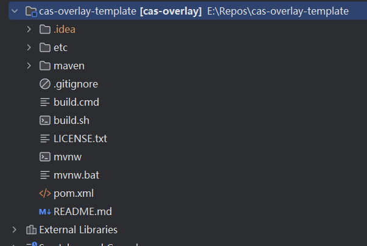
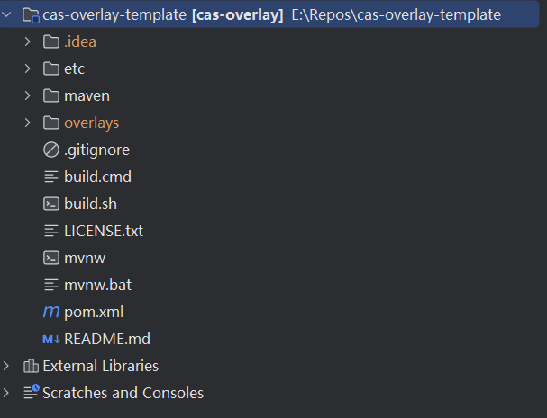
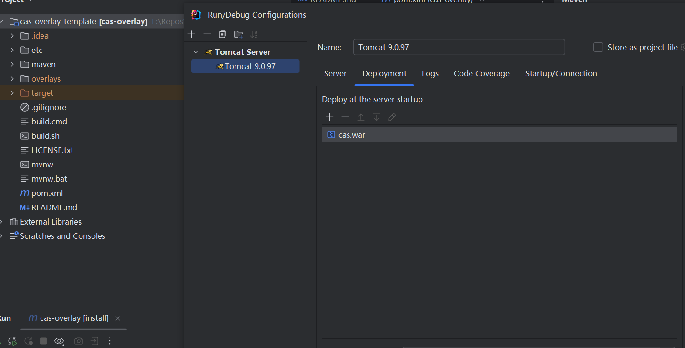
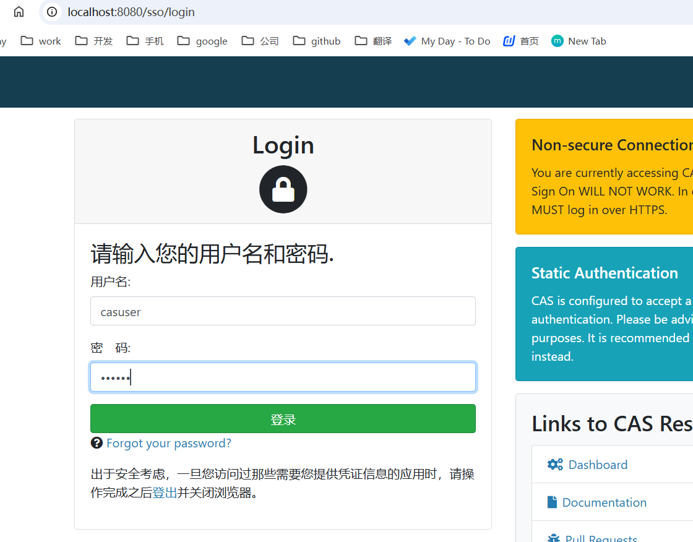
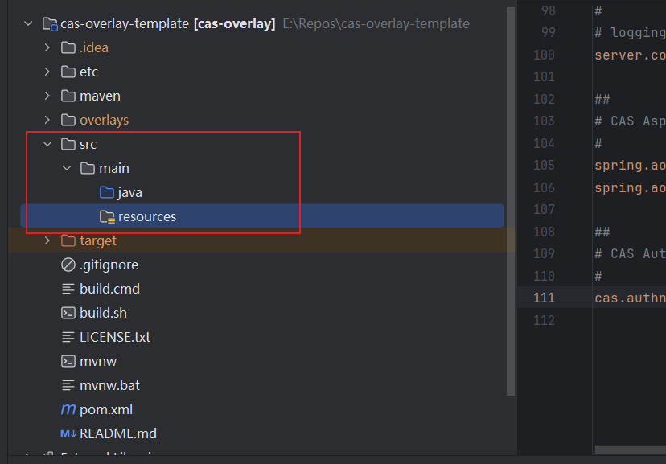

# Apereo CAS

## CAS Overlay

CAS Overlay 是一个模板项目，基于 Apereo CAS 的官方发布版本。它通过 Maven 或 Gradle 构建系统，允许你：

- 覆盖默认的 CAS 配置文件。
- 添加自定义的静态资源（如 CSS、JavaScript）。
- 扩展 CAS 功能（如自定义认证处理器、主题等）。
- 保持与官方 CAS 版本的兼容性，便于升级。

Overlay 的核心思想是“**覆盖**”，即你可以在不修改官方代码的情况下，通过添加或替换文件来实现自定义。

###  CAS Overlay 的优势

- **无需修改官方代码**：所有自定义内容都放在 Overlay 项目中，官方代码保持不变。
- **易于升级**：升级 CAS 版本时，只需更新 Overlay 项目的依赖版本即可。
- **模块化**：可以根据需要添加或移除功能模块。
- **灵活性**：支持通过配置文件、自定义类或静态资源进行深度定制。

### 代码仓库

1. 从apereo 中央仓库fork一份到github一份仓库

2. 下载下来的目录结构是

   

3. 导入之后会进行一个build会出现一个overlays目录

   

#### 本地启动

1. 先进build，install 之后会出现一个target目录里面包含一个war包，通过war包部署到本地tomcat中然后启动，启动之后访问进行使用默认账号密码登录





### 添加自定义配置和资源

CAS Overlay 模板项目是一个基础框架，默认不包含任何配置文件或资源。你需要手动创建 `src/main/resources` 目录，并根据需要添加配置文件



在 `src/main/resources` 目录下，添加以下常用配置文件：

#### **1. application.properties**

这是 CAS 的主配置文件，用于配置 CAS 的行为。例如：

```
# CAS 服务器配置
cas.server.name=https://localhost:8443
cas.server.prefix=${cas.server.name}/cas

# 日志配置
logging.config=classpath:log4j2.xml

# 数据库认证配置（示例）
cas.authn.jdbc.query[0].sql=SELECT * FROM users WHERE username=?
cas.authn.jdbc.query[0].url=jdbc:mysql://localhost:3306/cas
cas.authn.jdbc.query[0].user=root
cas.authn.jdbc.query[0].password=secret
```

#### **2. log4j2.xml**

配置 CAS 的日志输出。你可以从官方文档或示例项目中复制一个默认配置。

#### **3. services/ 目录**

用于存放服务注册文件（JSON 格式），定义哪些客户端应用可以使用 CAS。例如：

```
{
  "@class": "org.apereo.cas.services.RegexRegisteredService",
  "serviceId": "https://example.com/.*",
  "name": "Example Service",
  "id": 1,
  "description": "This service allows access to Example.com",
  "evaluationOrder": 1
}
```

------

#### 4. **添加静态资源（可选）**

如果你需要自定义 CAS 的界面（如修改登录页面），可以将静态资源（CSS、JavaScript、图片等）放在 `src/main/webapp/resources` 目录下。

```
src/
└── main/
    └── webapp/
        └── resources/
            ├── css/
            │   └── custom-style.css
            └── images/
                └── logo.png
```

------

