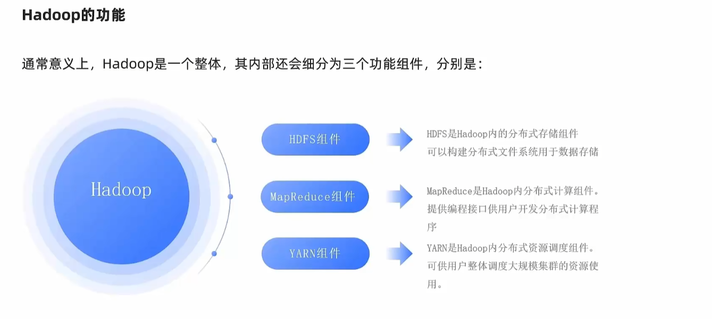
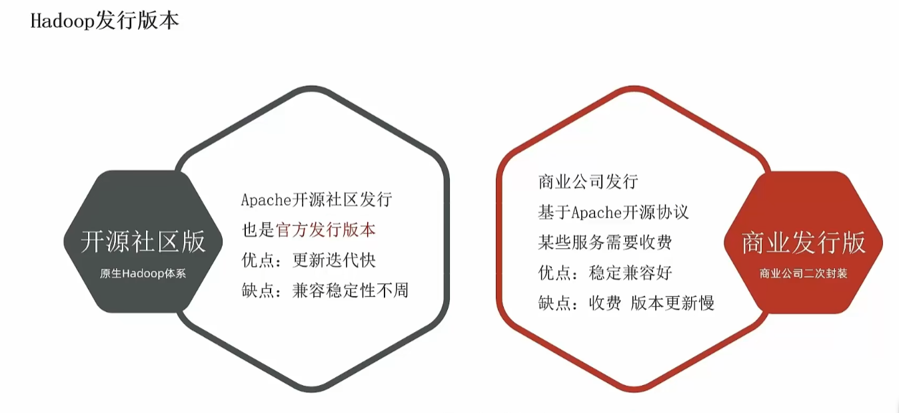
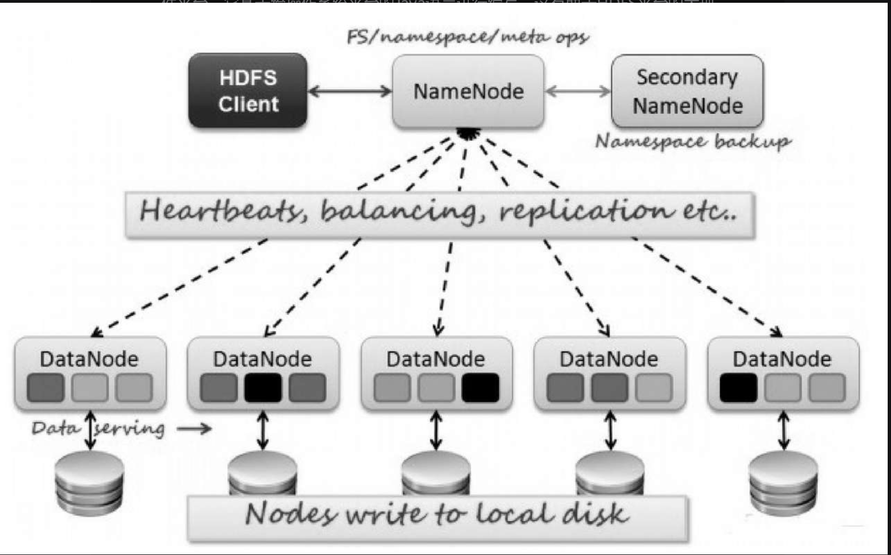
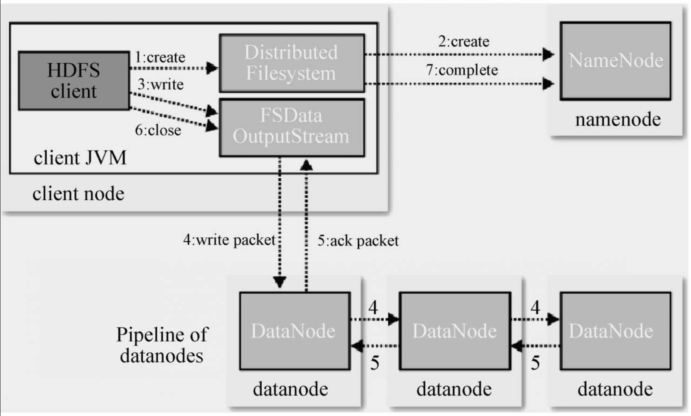
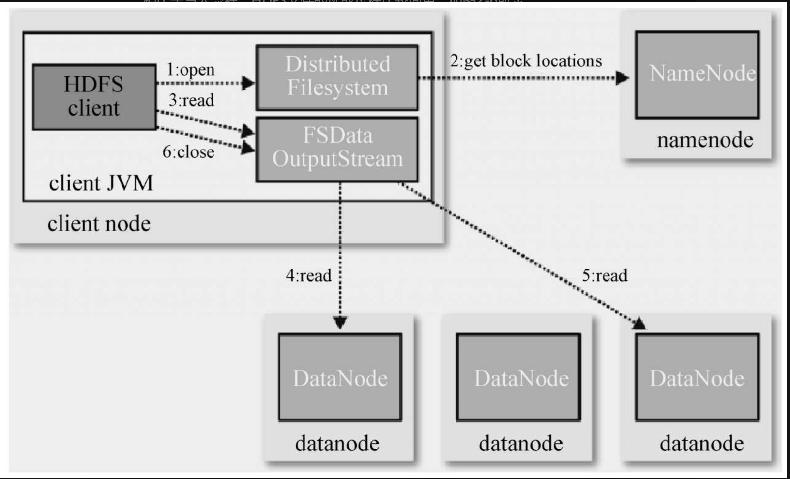
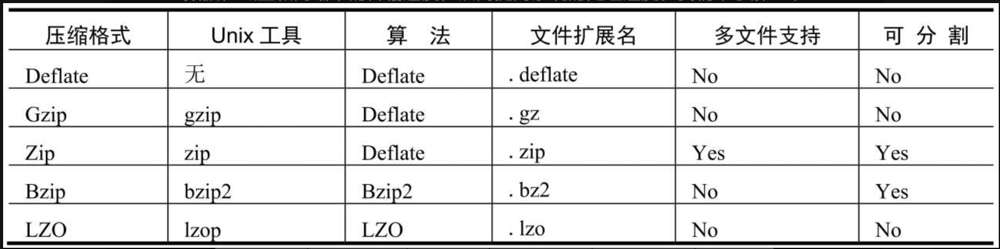
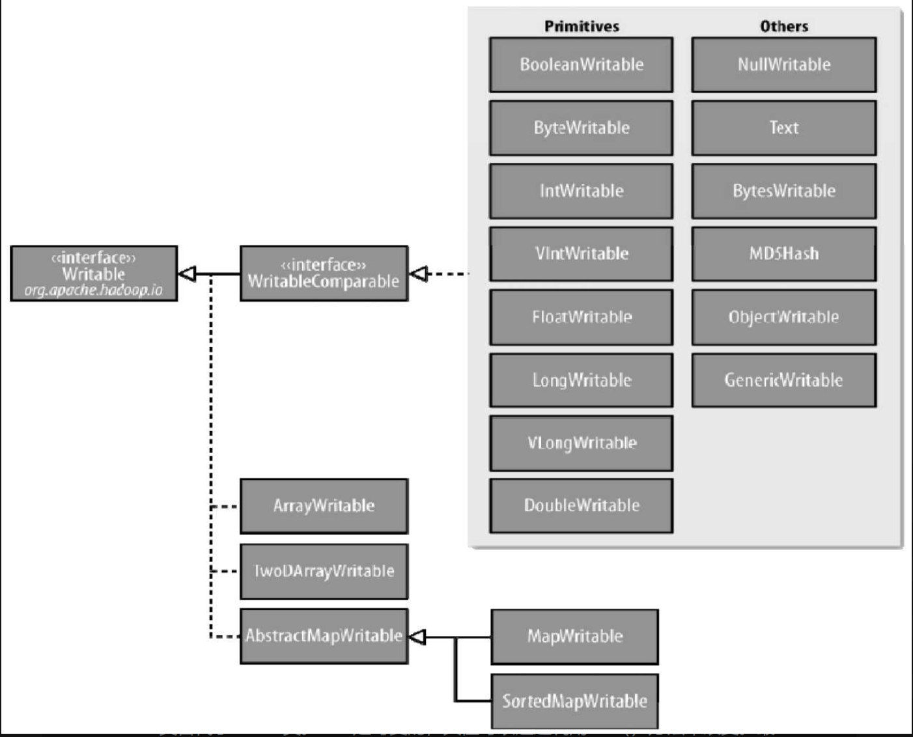
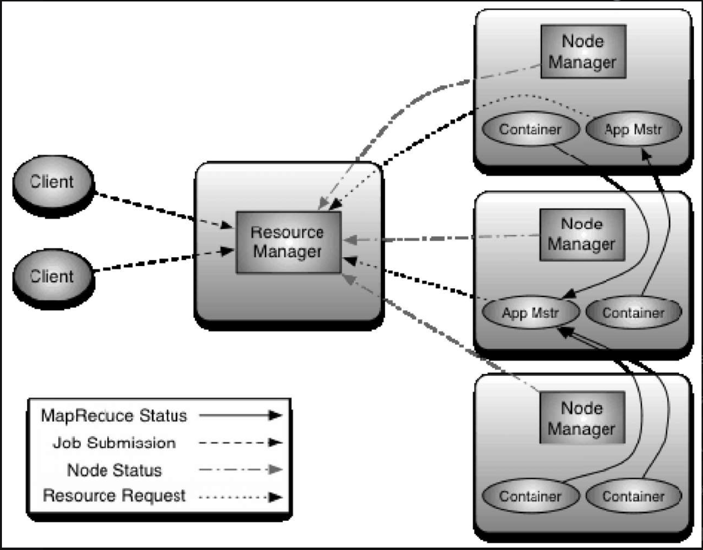
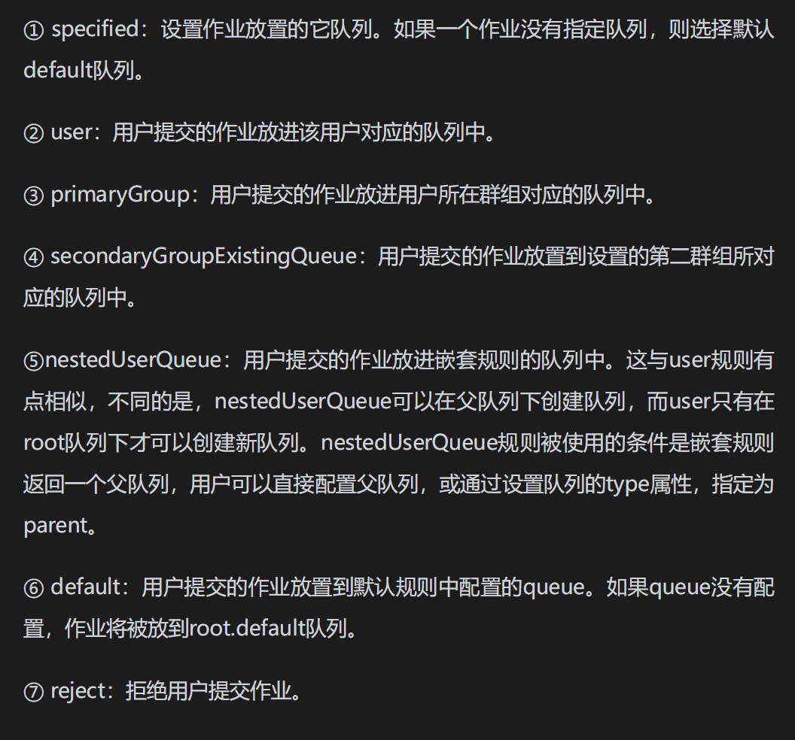

# Hadoop

## 简述

Hadoop是Apache开源项目。提供一套整体解决方案。

- 分布式数据存储 hdfs
- 分布式数据计算 MapReduce
- 分布式资源调度 Yarn



###  Hadoop版本



#### 开源的版本

Apache开源社区版本

Http://hadoop.apache.org

#### 商业发行版

- CDH (Cloudera's Distribution Including Apache Hadoop) CDH是Hadoop发行版的一种，是一套目前比较完整的、充分测试的Hadoop及其相关项目的发行版
- HDP  (Hortonworks Data Platform) ,Hortonworks 公司出品目前被Cloudera收购
- 星环 ,国产商业版本，星环公司出品，在国内政企使用较多

## HDFS

Hadoop Disrtibuted File System Hadoop 分布式文件系统

HDFS是Hadoop内的分布式存储组件。可以构建分布式文件系统，用于数据存储。

HDFS是Hadoop的核心子项目，是整个Hadoop平台数据存储与访问的基础，在此之上，承载其他如MapReduce、HBase等子项目的运转。

HDFS是类似于Google FS的开源分布式文件系统，被设计成适合运行在通用硬件上的分布式文件系统。它与现有的分布式文件系统有很多共同点。但同时，它与其他的分布式文件系统的区别也是很明显的。

HDFS是一个高度容错性的系统，适合部署在廉价的机器上。HDFS能提供高吞吐量的数据访问，非常适合大规模数据集上的应用。HDFS放宽了一部分POSIX约束，来实现流式读取文件系统数据的目的

### 分布式文件系统

分布式文件系统（Distributed File System, DFS）指通过一套管理系统，能够将文件分散至不同的计算机进行存储，并通过规范的标准协议，方便客户机进行高效存取。

与单机的文件系统不同，分布式文件系统不是将数据放在一块磁盘上由上层操作系统来管理，而是存放在一个服务器集群上，由集群中的服务器通过各尽其责、通力合作的方式提供整个文件系统的服务。将固定于某个地点的某个文件系统，扩展到任意多个地点/多个文件系统，这些节点组成一个文件系统网络。每个节点可以分布在不同的地点，通过网络进行节点间的通信和数据传输。人们在使用分布式文件系统时，无须关心数据是存储在哪个节点上，或者是从哪个节点获取的，只需要像使用本地文件系统一样管理和存储文件系统中的数据即可。

分布式文件系统中，重要的服务器包括：主控服务器（Master/NameNode）、数据服务器（一般称为ChunkServer或DataNode）和客户服务器（Client）

**常见的分布式文件系统**

分布式文件系统既有开源软件平台解决方案，如Hadoop HDFS、Fast DFS等；也有非开源平台解决方案，如最为著名的Google FS、也有像Windows Server 2003/2008平台上的DFS组件等

#### 分布式文件系统特点

与传统文件系统相比，分布式文件系统具有以下主要特点。

- 可扩展性强。扩展能力是一个分布式文件系统最重要的特点。基本上，所有的分布式文件系统都支持随时随地对数据服务器进行扩展，提升存储容量和访问带宽等。有的系统还支持多个目录/主控服务器。
- 统一命名空间。采用统一命名空间，分布式文件系统对于客户端是完全透明的，客户端看到的是统一的全局命名空间，用户操作起来就像是管理本地文件系统。通过元数据管理，文件以块的方式采用多副本模式进行存放。
- 高性能。由于一个文件被分成多份，保存在不同的数据服务器上，访问时，可以同时读取，性能会达到最优。
- 高可用性。分布式文件系统必须具有高容错能力，即无论是客户端还是服务器出现故障，都不会影响整个系统的功能。为了做到这一点，单点失效是必须被避免的，例如使用资源冗余技术或者提供失效恢复服务。单个数据节点的故障并不会影响集群整体运转。
- 弹性存储。可以根据业务需要灵活地增加或缩减数据存储以及增删存储池中的资源，而不需要中断系统运行。弹性存储的最大挑战，是减小或增加资源时的数据震荡问题。

### HDFS 基础架构

- NameNode  
  - HDFS系统主角色，是一个独立的进程
  - 负责管理HDFS整个文件系统
  - 负责管理DataNode
- SecondaryNameNode
  - NameNode 辅助进程（独立进程）
  - 帮助NameNode完成元数据处理
- DataNode
  - HDFS系统的从角色，是一个独立进程
  - 主要负责数据的存储，存储和读取数据。

#### NameNode

1. 管理元数据信息。元数据信息包括名字空间、文件到文件块的映射、文件块到数据节点的映射三部分。管理文件块包括创建新文件块、文件复制、移除无效文件块以及回收孤立文件块等内容。
2. 管理文件系统的命名空间。任何对文件系统元数据产生修改的操作，NameNode都会使用事务日志记录（下称EditLog）来表示；同样地，修改文件的副本系数也将往EditLog中插入一条记录，NameNode将EditLog存储在本地操作系统的文件系统中。同时，文件系统的命名空间被存储在一个称为映像文件（FsImage）的文件中，包括文件的属性、文件块到文件的映射以及文件块到数据节点的映射等内容，FsImage文件也是存放在NameNode所在的本地文件系统中。
3. 监听请求。指监听客户端事件和DataNode事件。客户端事件包含名字空间的创建和删除，文件的创建、读写、重命名和删除，文件列表信息获取等信息。DataNode事件主要包括文件块信息、心跳响应、出错信息等。处理请求指处理上面的监听请求事件并返回结果
4. 心跳检测。DataNode会定期将自己的负载情况通过心跳信息向NameNode汇报。NameNode全权管理数据块的复制，它周期性地从集群中的每个DataNode接收心跳信号和块状态报告（Block Report）。接收到心跳信号意味着该DataNode节点工作正常。块状态报告包含了一个该DataNode上所有数据块的列表。NameNode决定是否将文件映射到DataNode的复制块上。对于最常见的三个复制块，第一个复制块存储在同一机架的不同节点上，最后一个复制块存储在不同机架的某个节点上。实际的I/O事务并没有经过NameNode，只有表示DataNode和块的文件映射的元数据经过NameNode。当外部客户机发送请求，要求创建文件时，NameNode会以块标识和该块的第一个副本的DataNode IP地址作为响应。这个NameNode还会通知其他将要接收该块的副本的DataNode。NameNode在FsImage文件中存储所有关于文件系统名称空间的信息，包含所有事务的记录文件EditLog存储在NameNode的本地文件系统上。FsImage和EditLog文件也需要复制副本

#### SecondaryNameNode

当HDFS集群运行一段时间后，就会出现下面一些问题：

1. edit logs文件会变的很大，怎么去管理这个文件是一个挑战。
2. NameNode重启会花费很长时间，因为有很多改动要合并到fsimage文件上。
3. 如果NameNode挂掉了，那就丢失了一些改动。因为此时的fsimage文件非常旧。

因此为了克服这个问题，我们需要一个易于管理的机制来帮助我们**减小edit logs文件的大小和得到一个最新的fsimage文件**，这样也会减小在NameNode上的压力。这跟Windows的恢复点是非常像的，Windows的恢复点机制允许我们对OS进行快照，这样当系统发生问题时，我们能够回滚到最新的一次恢复点上。

SecondaryNameNode就是来帮助解决上述问题的，它的职责是合并NameNode的edit logs到fsimage文件中.

每达到触发条件，会由secondary namenode将namenode上积累的所有edits和一个最新的fsimage下载到本地，并加载到内存进行merge（这个过程称为checkpoint）

**如果NameNode中的fsimage真的出问题了，还是可以用SecondaryNamenode中的fsimage替换一下NameNode上的fsimage，虽然已经不是最新的fsimage，但是我们可以将损失减小到最少**

#### DataNode

1. 数据块的读写。一般是文件系统客户端需要请求对指定的DataNode进行读写操作，DataNode通过DataNode的服务进程与文件系统客户端打交道。同时，DataNode进程与NameNode统一结合，对是否需要对文件块的创建、删除、复制等操作进行指挥与调度，当与NameNode交互过程中收到了可以执行文件块的创建、删除或复制操作的命令后，才开始让文件系统客户端执行指定的操作。具体文件的操作并不是DataNode来实际完成的，而是经过DataNode许可后，由文件系统客户端进程来执行实际操作
2. 向NameNode报告状态。每个DataNode节点会周期性地向NameNode发送心跳信号和文件块状态报告，以便NameNode获取到工作集群中DataNode节点状态的全局视图，从而掌握它们的状态。如果存在DataNode节点失效的情况，NameNode会调度其他DataNode执行失效节点上文件块的复制处理，保证文件块的副本数达到规定数量
3. 执行数据的流水线复制。当文件系统客户端从NameNode服务器进程中获取到要进行复制的数据块列表（列表中包含指定副本的存放位置，亦即某个DataNode节点）后，会首先将客户端缓存的文件块复制到第一个DataNode节点上，此时，并非整个块都复制到第一个DataNode完成以后才复制到第二个DataNode节点上，而是由第一个DataNode向第二个DataNode节点复制，如此反复进行下去，直到完成文件块及其块副本的流水线复制


### HDFS 特点

1. **硬件故障是常态**：整个HDFS系统可以由数百或数千个存储着文件数据片段的服务器组成。实际上，它里面有非常巨大的组成部分，每一个组成部分都很可能出现故障，这就意味着HDFS里总是有一些部件是失效的，因此故障的检测和自动快速恢复是HDFS一个很核心的设计目标。
2. **流式数据访问** ： HDFS被设计成适合批量处理的，而不是用户交互式的。POSIX的很多硬性需求对于HDFS应用都是非必需的，HDFS放宽了POSIX的要求，这样，可以实现以流的形式访问（Streaming Access）文件系统中的数据。同时去掉POSIX一小部分关键语义，可以获得更好的数据吞吐率。
3. **简单的一致性** ：模型大部分HDFS程序对文件操作需要的是一次写、多次读取的操作模式。HDFS假定一个文件一旦创建、写入、关闭之后就不需要修改了。这简单化了数据一致的问题，并使高吞吐量的数据访问变得可能
4. **名字节点（NameNode）和数据节点（DataNode）** ：HDFS是一个主从结构，一个HDFS集群包括一个名字节点（也叫名称节点），它是一个管理文件命名空间和调节客户端访问文件的主服务器，当然，还有一些数据节点，通常是一个节点一个机器，它来管理对应节点的存储。HDFS对外开放文件命名空间，并允许用户数据以文件形式存储。内部机制是将一个文件分割成一个或多个块，这些块被存储在一组数据节点中。名字节点用来操作文件命名空间的文件或目录操作，如打开、关闭、重命名等。它同时确定块与数据节点的映射。数据节点负责来自文件系统客户的读写请求。数据节点同时还要执行块的创建、删除，以及来自名字节点的块复制指令。
5. **大规模数据集** ：HDFS被设计为PB级以上存储能力，单个的存储文件可以是GB或者TB级。因此，HDFS的一个设计原则是支持成千上万大数据文件的存储，即将单个文件分成若干标准数据块，分布存储于多个节点上，当用户访问整个文件时，由这些节点集群向用户传输所拥有的数据块，由此可以获得极高的并行数据传输速率
6. **可移植性** ： HDFS在设计之初，就考虑到了异构软硬件平台间的可移植性，能够适应于主流硬件平台。它基于跨操作系统平台的Java语言进行编写，这有助于HDFS平台的大规模应用推广


集群中，一台机器上只运行一个NameNode实例，而集群中其他机器分别运行一个DataNode实例。NameNode是一个中心服务器，负责管理文件系统的名字空间以及客户端对文件的访问，用户能够以文件的形式在上面进行名字空间操作，比如打开、关闭、重命名文件或目录，同时，NameNode还决定了数据块到数据节点的映射关系。NameNode也可以称为管理文件系统的元数据。集群中，每一个节点配置一个DataNode，每个DataNode负责管理它所在节点上的数据存储。从内部看，一个文件被分成一个或多个数据块，这些块存储在一组DataNode上。同时，DataNode负责处理文件系统客户端的读写请求，在NameNode的统一调度下进行数据块的创建、删除和复制。

**HDFS的数据块**：磁盘存储文件时，是按照数据块（block）来存储的，也就是说，数据块是磁盘读/写的最小单位。数据块也称磁盘块。在HDFS中也有块的概念，默认为64MB，每个块作为独立的存储单元。



HDFS提供给应用程序例如MapReduce数据服务。一般来说，MapReduce的Map任务通常一次处理一个块中的数据，如果任务数太少（少于集群中节点的数量），就没有发挥多节点的优势，甚至作业的运行速度就会与单节点一样

### HDFS数据操作

HDFS被设计成在一个大集群中可以跨机器地可靠地存储海量的文件。它将每个文件存储成block（即数据块）序列，除了最后一个block，其他所有的block都是同样的大小

#### 数据写入

HDFS写入流程如下：



**具体流程描述如下**。

1. Client调用DistributedFileSystem对象的create方法，创建一个文件输出流（FSDataOutputStream）对象
2. 通过DistributedFileSystem对象与Hadoop集群的NameNode进行一次远程调用（RPC），在HDFS的Namespace中创建一个文件条目（Entry），该条目没有任何的数据块。
3. 通过FSDataOutputStream对象，向DataNode写入数据，数据首先被写入FSDataOutputStream对象内部的Buffer中，然后数据被分割成一个个Packet数据包。
4. 以Packet为最小单位，基于Socket连接发送到按特定算法选择的HDFS集群中的一组DataNode（正常是3个，可能大于等于1）中的一个节点上，在这组DataNode组成的Pipeline上依次传输Packet。
5. 这组DataNode组成的Pipeline反方向上发送ack确认，最终由Pipeline中第一个DataNode节点将Pipeline ack发送给Client.
6. 完成向文件写入数据，Client在文件输出流（FSDataOutputStream）对象上调用close方法，关闭流。
7. 调用DistributedFileSystem对象的complete方法，通知NameNode文件写入成功。

**写文件过程中，Client/DataNode与NameNode进行的RPC调用**。

- 写文件开始时创建文件：Client调用create，在NameNode节点的命名空间中创建一个标识该文件的条目。
- 在Client连接Pipeline中第一个DataNode节点之前，Client调用addBlock分配一个数据块。
- 如果与Pipeline中第一个DataNode节点连接失败，Client调用abandonBlock放弃一个已经分配的数据块。
- 一个Block已经写入到DataNode节点磁盘，Client调用fsync让NameNode持久化数据块的位置信息数据。
- 文件写完以后，Client调用complete方法通知NameNode写入文件成功。
- DataNode节点接收到并成功持久化一个数据块的数据后，调用blockReceived方法通知NameNode已经接收到数据块

#### 数据读取

数据读取示意图：



**文件的读取操作流程如下。**

1. 客户端调用FileSystem的open()函数打开文件，DistributedFileSystem用RPC调用元数据节点，得到文件的数据块信息。
2. 对于每一个数据块，元数据节点返回保存数据块的数据节点的地址。DistributedFileSystem返回FSDataInputStream给客户端，用来读取数据。
3. 客户端调用stream的read()函数开始读取数据。
4. DFSInputStream连接保存此文件第一个数据块的最近的数据节点。
5. Data从数据节点读到客户端，当此数据块读取完毕时，DFSInputStream关闭与此数据节点的连接，然后连接此文件下一个数据块的最近的数据节点。
6. 当客户端读取数据完毕的时候，调用FSDataInputStream的close函数。在读取数据的过程中，如果客户端在与数据节点通信时出现错误，则尝试连接包含此数据块的下一个数据节点。失败的数据节点将被记录下来，以后不再连接

### HDFS 日志和检查点

Hadoop中有两个非常重要的文件fsimage和edits，它们位于NameNode的$dfs.namenode.name.dir/current/文件夹中。在current目录中，我们可以看到存在大量的以edits开头的文件和少量的以fsimage开头的文件。

**对edits和fsimage文件的概念说明如下**。

1. edits文件存放的是Hadoop文件系统的所有更新操作的日志，HDFS文件系统客户端执行的所有写操作首先会被记录到edits文件中。
2. fsimage文件是Hadoop文件系统元数据的一个永久性检查点，其中包含Hadoop文件系统中的所有目录和文件的索引节点序列化信息。对于文件来说，包含的信息有修改时间、访问时间、块大小信息等；对于目录来说，包含的信息主要有修改时间、访问控制权限等信息。fsimage并不包含DataNode的信息，而是包含DataNode上块的映射信息，并存放到内存中，当一个新的DataNode加入到集群中时，DataNode都会向NameNode提供块的信息，而NameNode会定期地索取块的信息，以使得NameNode拥有最新的块映射

在NameNode启动的时候，会将fsimage文件中的内容加载到内存中，然后再执行edits文件中的各项操作，使得内存中的元数据与实际的同步。存在于内存中的元数据支持客户端的读操作。

NameNode启动后，HDFS中的更新操作会重新写到edits文件中。对于一个文件来说，当所有的写操作完成以后，在向客户端发送成功代码之前，将同步更新edits文件。在NameNode运行期间，由于HDFS的所有更新操作都是直接写到edits中的，时间长了会导致edits文件变得很大。

在Hadoop 1.x中，通过SecondaryName合并fsimage和edits，以此来减小edits文件的大小，从而减少了NameNode重启的时间。<font color="red">在Hadoop 2.x中，已经不用SecondaryName，通过配置HA机制实现，即在standby NameNode节点上运行一个叫作CheckpointerThread的线程，这个线程调用StandbyCheckpointer类的doWork()函数，每隔一定的时间（可配置）做一次合并操作</font>。

edits和fsimage文件中的内容使用普通文本编辑器是无法直接查看的，为此，Hadoop准备了专门的工具，用于查看文件的内容，分别为**oev和oiv**.

**如果fsimage丢失或者损坏了，我们将失去文件到块的映射关系，也就无法使用DataNode上的所有数据了。因此，定期及时地备份fsimage和edits文件非常重要**

#### oev

oev是offline edits viewer（离线edits查看器）的缩写，该工具只操作文件，并不需要Hadoop集群处于运行状态。oev提供了几个输出处理器，用于将输入文件转换为相关格式的输出文件，可以使用参数-p指定。目前支持的输出格式有binary（Hadoop使用的二进制格式）、xml（在不使用参数p时的默认输出格式）和stats（输出edits文件的统计信息）。由于没有与stats格式对应的输入文件，所以，一旦输出为stats格式，将不能再转换为原有格式。比如输入格式为binary，输出格式为xml，可以通过将输入文件指定为原来的输出文件，将输出文件指定为原来的输入文件，实现binary和xml的转换，而stats则不可以.

#### oiv

oiv是offline image viewer的缩写，用于将fsimage文件的内容转储到指定文件中，以便于阅读，该工具还提供了只读的WebHDFS API，以允许离线分析和检查Hadoop集群的命名空间。oiv在处理非常大的fsimage文件时是相当快的，如果不能够处理fsimage，它会直接退出。oiv不具备向后兼容性，比如使用Hadoop 2.4版本的oiv不能处理hadoop 2.3版本的fsimage，只能使用Hadoop 2.3版本的oiv。与oev一样，oiv也不需要Hadoop集群处于运行状态。oiv的具体语法可以通过在命令行输入“hdfs oiv”来查看

### HDFS 快照

在Hadoop 2.x版本中，HDFS提供了支持元数据快照的解决方案。快照（Snapshot）支持存储在某个时间的数据复制，当HDFS数据损坏时，可以回滚到过去一个已知正确的时间点。

快照分为两种：一种是建立文件系统的索引，每次更新文件不会真正改变文件，而是新开辟一个空间用来保存更改的文件；一种是复制所有的文件系统。HDFS把元数据和数据分离，元数据被存储在单独的NameNode上，实际的数据被复制并扩散到整个集群。使用单个节点来管理元数据，使我们能够使用一个单一的逻辑时钟，建立元数据快照。

HDFS的快照是在某一时间点对指定文件系统复制，可以是整个文件系统的，也可以是文件系统的一部分。快照采用只读模式，对重要数据进行恢复、防止用户错误性的操作。HDFS的快照有以下特征：

- 快照的创建是瞬间的，代价为O（1），取决于子节点扫描文件目录的时间。
- 当且仅当快照的文件目录下有文件更新时，才会占用小部分内存，占用内存的大小为O（M），其中，M为更改文件或者目录的数量。
- 新建快照时，DataNode中的block不会被复制，快照中只是记录了文件块的列表和大小等信息。
- 快照不会影响正常文件系统的读写等操作。对做快照之后的数据进行的更改将会按照时间顺序逆序记录下来，用户访问的还是当前最新的数据，快照里的内容为快照创建的时间点时文件的内容减去当前文件的内容。

### HDFS 数据存储

#### 数据完整性

I/O操作过程中，难免会出现数据丢失或脏数据，数据传输的量越大，出错的概率越高。校验错误最常用的办法，就是传输前计算一个校验和，传输后计算一个校验和，两个校验和如果不相同，就说明数据存在错误。为了保证数据的完整性，一般采用下列数据校验技术：奇偶校验技术；MD5、SHA1等校验技术；CRC-32循环冗余校验技术；ECC内存纠错校验技术。其中，比较常用的错误校验码是CRC-32。

HDFS将一个文件分割成一个或多个数据块，这些数据块被编号后，由名字节点保存，通常需要记录的信息包括文件的名称、文件被分成多少块、每块有多少个副本、每个数据块存放在哪个数据节点上、其副本存放于哪些节点上，这些信息被称为元数据。

HDFS为了保证数据的完整性，采用校验和（checksum）检测数据是否损坏。当数据第一次引入系统时计算校验和，并且在一个不可靠的通道中传输的时候，再次检验校验和。但是，这种技术并不能修复数据（注意：校验和也可能损坏，但是，由于校验和小得多，所以可能性非常小）。数据校验和采用的是CRC-32，任何大小的数据输入都可以通过计算，得出一个32位的整数校验和。

DataNode在接收到数据后存储该数据及其校验和，或者将数据和校验和复制到其他的DataNode上。当客户端写数据时，会将数据及其DataNode发送到DataNode组成的管线，最后一个DataNode负责验证校验和，如果有损坏，则抛出ChecksumException，这个异常属于IOException的子类。客户端读取数据的时候，也会检验校验和，会与DataNode上的校验和进行比较。每个DataNode上面都会有一个用于记录校验和的日志。客户端验证完之后，会告诉DataNode，然后更新这个日志。不仅客户端在读写数据的时候验证校验和，每个DataNode也会在后台运行一个DataBlockScanner，从而定期检查存储在该DataNode上面的数据块。

如果客户端发现有block坏掉，按照以下步骤进行恢复。

1. 客户端在抛出ChecksumException之前，会把坏的block和block所在的DataNode报告给NameNode。
2. NameNode把这个block标记为已损坏，这样，NameNode就不会把客户端指向这个block，也不会复制这个block到其他的DataNode。
3. NameNode会把一个好的block复制到另外一个DataNode。
4. NameNode把坏的block删除。


HDFS会存储每个数据块的副本，可以通过数据副本来修复损坏的数据块。客户端在读取数据块时，如果检测到错误，首先向NameNode报告已损坏的数据块及其正在尝试读取操作的这个DataNode。NameNode会将这个数据块标记为已损坏，对这个数据块的请求会被NameNode安排到另一个副本上。之后，它安排这个数据块的另一个副本复制到另一个DataNode上，如此，数据块的副本因子又回到期望水平。此后，已损坏的数据块副本会被删除。

**Hadoop的LocalFileSystem执行客户端的校验和验证。当写入一个名为filename的文件时文件系统客户端会明确地在包含每个文件块校验和的同一个目录内建立一个名为filename.crc的隐藏文件**

#### 数据压缩

Hadoop作为一个较通用的海量数据处理平台，每次运算都会需要处理大量的数据。使用文件和数据压缩技术有明显的优点：

1. 节省数据占用的磁盘空间；
2. 加快数据在磁盘和网络中的传输速度，从而提高系统的处理速度

Hadoop支持多种压缩格式。我们可以把数据文件压缩后再存入HDFS，以节省存储空间。



所有的压缩算法都存在空间与时间的权衡：更快的压缩速率和解压速率是以牺牲压缩率为代价的。Deflate算法是同时使用了LZ77与哈夫曼编码的一个无损数据压缩算法，源代码可以在zlib库中找到。Gzip算法是以Deflate算法为基础扩展出来的一种算法。Gzip在时间和空间上比较适中，Bzip2算法压缩比Gzip更有效，但速度更慢。Bzip2的解压速度比它的压缩速度要快，但与其他压缩格式相比，又是最慢的，但压缩效果明显是最好的。

LZO是一种既能够被分块并且并行处理速度也非常快的压缩算法。在Hadoop中，使用LZO压缩算法可以减小数据的大小并缩短数据的磁盘读写时间，在HDFS中存储压缩数据，可以使集群能保存更多的数据，延长集群的使用寿命。不仅如此，由于MapReduce作业通常瓶颈都在I/O上，存储压缩数据就意味着更少的I/O操作，作业运行更加高效。。例如，将压缩文件直接作为入口参数交给MapReduce处理，MapReduce会自动根据压缩文件的扩展名来自动选择合适的解压器处理数据。

LZO的压缩文件是由许多小的blocks组成（约256KB），使得Hadoop的作业可以根据block的划分来分块工作（split job）。不仅如此，LZO在设计时就考虑到了效率问题，它的解压速度是Gzip的两倍，这就让它能够节省很多的磁盘读写，它的压缩比不如Gzip，大约压缩出来的文件比Gzip压缩的大一半，但是，这仍然比没有经过压缩的文件要节省20%～50%的存储空间，这样，就可以在效率上大大地提高作业执行的速度。在考虑如何压缩由MapReduce程序将要处理的数据时，压缩格式是否支持分割是很重要的。

#### 序列化

序列化是指将结构化对象转换成字节流，以便于进行网络传输，或写入持久存储的过程。与之相对的反序列化，就是将字节流转化为一系列结构化对象的过程。

**序列化有以下特征。**

- 紧凑：可以充分利用稀缺的带宽资源。
- 快速：通信时大量使用序列化机制，因此，需要减少序列化和反序列化的开销。
- 可扩展：随着通信协议的升级而可升级。
- 互操作：支持不同开发语言的通信。

**序列化的主要作用如下：**

- 作为一种持久化格式。

- 作为一种通信的数据格式，支持不同开发语言的通信。

- 作为一种数据拷贝机制。


Hadoop的序列化机制与Java的序列化机制不同，它实现了自己的序列化机制，将对象序列化到流中，值得一提的是，Java的序列化机制是不断地创建对象，但在Hadoop的序列化机制中，用户可以复用对象，减少了Java对象的分配和回收，提高了应用效率


在分布式系统中，进程将对象序列化为字节流，通过网络传输到另一进程，另一进程接收到字节流，通过反序列化，转回到结构化对象，以实现进程间通信。在Hadoop中，Mapper、Combiner、Reducer等阶段之间的通信都需要使用序列化与反序列化技术。序列化是Hadoop核心的一部分，在Hadoop中，位于org.apache.hadoop.io包中的Writable接口是Hadoop序列化格式的实现。

Hadoop的Writable接口是基于DataInput和DataOutput实现的序列化协议，紧凑（高效使用存储空间）、快速（读写数据、序列化与反序列化的开销小）。Hadoop中的键（key）和值（value）必须是实现了Writable接口的对象（键还必须实现WritableComparable，以便进行排序）。Hadoop自身提供了多种具体的Writable类，包含了常见的Java基本类型（boolean、byte、short、int、float、long和double等）和集合类型（BytesWritable、ArrayWritable和MapWritable等）



Text:Text是UTF-8的Writable，可以理解为与java.lang.String相类似的Writable。Text类替代了UTF-8类。Text是可变的，其值可以通过调用set（）方法来改变。最大可以存储2GB的大小。

NullWritable:NullWritable是一种特殊的Writable类型，它的序列化长度为零，可以用作占位符。BytesWritable:BytesWritable是一个二进制数据数组封装，序列化格式是一个int字段。BytesWritable是可变的，其值可以通过调用set（）方法来改变。

ObjectWritable:ObjectWritable适用于字段使用多种类型时。ArrayWritable和TwoDArrayWritable是针对数组和二维数组的。

MapWritable和SortedMapWritable是针对Map和SortMap的。虽然Hadoop内建了多种Writable类供用户选择，Hadoop对Java基本类型的包装Writable类实现的RawComparable接口，使得这些对象不需要反序列化过程，便可以在字节流层面进行排序，从而大大缩短了比较的时间开销。

当提供的不满足时需要我们自己实现Writable类。

### 部署HDFS

## YARN

YARN 是Hadoop内分布式资源调度组件，可供用户整体调度大规模的集群资源使用。

Apache Hadoop YARN（Yet Another Resource Negotiator，另一种资源协调者）是从Hadoop 0.23进化来的一种新的资源管理和应用调度框架。基于YARN，可以运行多种类型的应用程序，例如MapReduce、Spark、Storm等。YARN不再具体管理应用，资源管理和应用管理是两个低耦合的模块。

YARN从某种意义上来说，是一个云操作系统（Cloud OS）。基于该操作系统之上，程序员可以开发多种应用程序，例如批处理MapReduce程序、Spark程序以及流式作业Storm程序等。这些应用可以同时利用Hadoop集群的数据资源和计算资源。此外，还可以利用YARN的资源管理器，提供新的应用管理器实现。

### 模块

YARN的主要模块包括如下几种。

- 资源管理器ResourceManager（RM）：管理全部计算资源给各种应用，RM和每个节点上的NodeManager构成资源管理和作业调度框架。
- 节点管理器NodeManager（NM）：管理在该节点上的所有用户进程，并向RM汇报资源情况、用户进程情况。
- 应用管理器ApplicationMaster（App Mstr或AM）：管理作业的启动和状态跟踪，对失败任务进行重试。每类应用的提交运行都要有对应的App Mstr来管理。

YARN的设计初衷，是分离资源管理和作业调度/监控功能。核心思路是建立一个全局的资源管理器（RM）和多类型的作业管理器（AM）。任何一个作业提交后（或者是单一的job，或者是由多个组件构成的DAG有向无环图），都有两个守护进程，分别是RM和AM，两者构成了数据计算框架.

#### 资源管理器ResourceManager

RM具有对集群系统中所有作业进行资源分配的最高的权限.

RM有两个重要的功能模块：调度器（Scheduler）和应用管理者（ApplicationsManager，注意不是ApplicationMaster）。调度器负责为各种作业程序分配资源。调度器只负责调度职责，不涉及监控或者跟踪作业状态的功能。调度器虽然负责作业调度，但它不负责失败作业的重启、失败任务的重启、硬件引起的失败故障。调度器根据作业的请求，以容器的形式进行调度，容器包含的元素有CPU、内存、硬盘、带宽等。调度器选型可通过配置制定和变更，根据队列、作业对集群资源进行划分。目前的调度器有容量调度器（CapacityScheduler）和公平调度器（FairScheduler）.

应用管理者（ApplicationsManager）负责接收提交作业，申请“第一容器”所需资源并提供服务，负责作业容器失败时的重启。每种类型应用的AM负责与调度器协定作业执行的资源容器，并跟踪作业状态、监控作业进度、故障处理等.

####  节点管理器NodeManager（NM）

NM是每个工作节点上的框架代理，主要负责容器开辟、监控容器的资源使用情况（CPU、内存、硬盘、带宽），并报告使用信息给RM.

NodeManager是运行在单个节点上的代理，它管理Hadoop集群中单个计算节点，功能包括与ResourceManager保持通信，管理Container的生命周期、监控每个Container的资源使用(内存、CPU等）情况、追踪节点健康状况、管理日志和不同应用程序用到的附属服务等。

NodeManager是YARN中单个节点的代理，它需要与应用程序的ApplicationMaster和集群管理者ResourceManager交互;它从ApplicationMaster上接收有关Container的命令并执行(比如启动、停止Contaner);向ResourceManager汇报各个Container运行状态和节点健康状况，并领取有关Container的命令（比如清理Container）。

####  应用管理器ApplicationMaster（App Mstr或AM）

每种类型的AM都是带有特定库的计算框架，AM从RM申请计算资源，并与NM一起执行、监控作业.

用户提交的每个应用程序都包含一个ApplicationMaster，与资源管理器协商获取资源，将获得的资源分配给具体的任务，负责与节点管理器通信以启动或停止具体任务，监控该应用管理器下的所有任务运行状态，当任务失败时，重新为任务申请资源.

### 容量调度器

容量调度器的核心思想是：Hadoop集群的计算资源可以在多个组织间共享，并且，一个组织可以使用其他组织的空闲资源，这在成本效益方面提供了弹性机制。组织间共享集群，就需要支持多租赁模式，因为每一个组织必须有容量担保，以确保共享集群的每一个作业或用户或队列都能分配到合适的资源。容量调度器提供了一种严格的规则来保证每个作业、用户、队列非平均地消费集群资源，以使集群的利用率和吞吐量最大化。同时，容量调度器对同一用户或同一队列的初始化和特定作业的资源分配进行限制，以确保集群资源分配的公平性和稳定性。 **Hadoop默认使用容量调度器进行队列分配资源**

容量调度器提出的基础概念是“队列”，“队列”由管理员设置，主要考量是共享集群的经济效益。为了提供更深入的控制和对共享资源的预见性，容量调度器支持多级队列，以确保一个队列的资源在各个子队列中被优先分配。在子队列都不再需要资源的情况下，其他队列才可以使用该队列的空闲计算资源。

#### 特性

1. 多级队列：队列的分级，是为了确保队列资源被其他队列使用前有更多的控制和预见性。
2. 容量担保：每个队列从资源总容量中申请的资源片段，用户提交作业到该队列，则使用该队列分配的资源。管理员可以对每个队列配置软限制和硬限制。
3. 安全：每个队列有严格的访问控制列表。用户提交作业后，具有对该作业的访问、控制权限，但其他用户不能查看或修改该应作业。注意：每个队列和系统管理员可以查看、修改访问控制列表。
4. 弹性：一个队列的空闲资源可以分配给其他队列的作业使用，即使该队列已经超出了配置的容量限制。队列中低于配置容量运行的作业对资源有更多需求时，其他队列的空闲资源将被分配过来。对集群中队列共享资源进行弹性分派，可以防止资源浪费，提高集群的利用率。
5. 多租赁：防止单个作业、用户、队列独占集群资源，并确保集群资源不会过载。
6. 操作性。
   1. 运行时配置：队列的定义和属性比如容量、ACLS，管理员可以在运行时修改。运行时修改队列的配置给用户造成的影响非常小。为管理员提供控制台来查看当前各个队列的分配情况。运行中，管理员可以增加新的队列，但是，不能删除队列。
   2. 关闭作业提交：管理员可以在运行时关闭队列提交功能，使得新作业不能被提交，以确保已开始作业运行完成。如队列的状态是STOPPED，新应用不能提交到该队列及该队列的子队列，但是，已经存在的作业将会继续运行完成，当所有作业执行完成时，队列的关闭操作将自动结束，管理员也可以START已经处于STOPPED状态的队列。
7. 基于资源的调度：对那些高资源需求的作业，可通过配置，来申请比默认高的资源，容量调度器可以满足对不同资源要求的作业。目前已支持对内存资源的需求管理。
8. 基于用户或群组的队列映射：这个属性允许用户根据用户或群组映射job到一个指定的队列

#### 配置

配置conf/yarn-site.xml

可以在etc/hadoop/下看到capacity-scheduler.xml，是专门配置容量调度器的配置文件。默认情况下，启动default队列，同时，还可配置一些其他参数，如：

```xml
        <property>
            <name>yarn.scheduler.capacity.root.queues</name>
            <value>default</value>
            <description>
              The queues at the this level (root is the root queue).
            </description>
        </property>
        <property>
            <name>yarn.scheduler.capacity.maximum-applications</name>
            <value>10000</value>
            <description>
              Maximum number of applications that can be pending and running.
            </description>
        </property>
        <property>
            <name>
              yarn.scheduler.capacity.root.default.acl_submit_applications
            </name>
            <value>＊</value>
            <description>
              The ACL of who can submit jobs to the default queue.
            </description>
        </property>
```

### 公平调度器(Fair Schduler)

YARN可以调度多种资源类型，默认情况下，公平调度器仅是基于内存的公平调度。当单一作业运行时，该作业使用整个集群的资源，当其他作业提交时，空闲资源被分配给新作业，每个作业最终获取了相同的处理资源时间。

公平调度器将所有的作业划分到不同的队列中，这些队列公平占有资源。默认情况下，所有用户都在一个队列中，这个队列的名称是default。当一个作业提交时，在容器中指定了队列，那么该作业就提交到对应的队列中，也可根据配置文件中基于用户的资源要求分配队列。每个队列中的运行作业共享该队列的资源。目前仅支持对内存的资源的公平调度，通过配置队列选项，可实现FIFO、主要资源公平调度的方式，队列还可通过分级或配置队列权重进行资源分配。

公平调度器对每个队列有最小资源担保，这是为了确保作业、用户、群组能得到足够的资源。当一个队列中有运行状态的作业时，公平调度器保证该队列获得最小资源，当队列不需要最小资源运行作业时，队列中的空闲资源将会被其他队列划分使用。这个调度策略使得在队列中没有作业时，资源可供其他队列使用，使得资源利用率更加高效。

#### 分级队列

公平调度器也支持分级队列，所有的队列都从root队列衍生而来。经典的公平调度方式是将资源分布到root队列的子队列中，并将分配到的资源放到子队列中，作业可在子队列中进行调度。通过配置子元素的方式指定某队列为其他队列的子队列。队列名称以父类队列的名称开始，用句点作为分隔符。

如root队列下的一个队列queue1的名称是root.queue1，那么parent1下的子队列名称为queue2，则引用方式为root.parent1.queue2。  

公平调度器允许用户为每个队列设置不同的用户规则来分享队列资源 主要规则有：FIFO规则、公平分享规则（默认）、主要资源公平规则。

公平调度器支持管理员配置策略，使提交的作业自动地放到对应队列中。公平调度器根据作业、用户、群组指定的队列信息放到指定的队列中。每个提交的作业根据策略中的规则放进一个队列。使用公平调度器，需要在yarn-site.xml文件中配置公平调度的类。

```xml
        <property>
            <name>yarn.resourcemanager.scheduler.class</name>
            <value>
              org.apache.hadoop.yarn.server.resourcemanager
                .scheduler.fair.FairScheduler
            </value>
        </property>
```

 #### 配置

yarn-site.xml中，公平调度器的配置信息如下:

```xml
<?xml version="1.0"? >
    <allocations>
            <queue name="sample_queue">
              <minResources>10000 mb,0vcores</minResources>              
              <maxResources>90000 mb,0vcores</maxResources>
              <maxRunningApps>50</maxRunningApps>
              <maxAMShare>0.1</maxAMShare>
              <weight>2.0</weight>
              <schedulingPolicy>fair</schedulingPolicy>
              <queue name="sample_sub_queue">
                  <aclSubmitApps>charlie</aclSubmitApps>
                  <minResources>5000 mb,0vcores</minResources>
              </queue>
          </queue>
          <queueMaxAMShareDefault>0.5</queueMaxAMShareDefault>
          <! -- Queue 'secondary_group_queue' is a parent queue and may have
            user queues under it -->
          <queue name="secondary_group_queue" type="parent">
              <weight>3.0</weight>
          </queue>
          <user name="sample_user">
              <maxRunningApps>30</maxRunningApps>
          </user>
          <userMaxAppsDefault>5</userMaxAppsDefault>
          <queuePlacementPolicy>
              <rule name="specified" />
              <rule name="primaryGroup" create="false" />
              <rule name="nestedUserQueue">
                  <rule name="secondaryGroupExistingQueue" create="false" />
              </rule>
              <rule name="default" queue="sample_queue"/>
          </queuePlacementPolicy>
        </allocations>        
```

##### 配置标签解析

1. `<queue>` 标签：队列元素可以带一个选项属性type，可以设置为parent，使它成为一个父队列。包含以下子标签。
   1. `<minResources>`  通过“X mb, Y vcores”格式，设置队列的最小资源数。对于单类型资源（内存）的公平策略，vcores的值是被忽略的。当一个队列的资源不能满足时，公平调度器将根据单资源公平策略重新分配
   2. `<maxResources>`通过“X mb, Y vcores”格式，设置队列的最大资源数。对于单类型资源（内存）的公平策略，vcores的值是被忽略的。队列获得的资源的总和不能超过该最大资源限制数
   3. `<maxRuningApps>`  限制队列同时运行的作业数
   4. `<maxAmShare> `设置可用于运行Application Master的资源比例。该属性可只在子队列中使用。例如设置为1.0f，则表示Application Master可以占用100%的内存和CPU资源，而当值为-1.0f时，表示跳过该属性检查。默认情况下，该值为0.5f
   5. `<weight>` 设置非等比的占有集群资源的比重。Weight默认值为1，当权重为2时，表示该队列将得到大约2倍于默认配置的资源
   6. `<schedulingPolicy>` 设置队列的调度规则。该属性的可选项为：fifo、fair、drf或自研调度规则类型。但必须继承并实现org.apache.hadoop.yarn.server.resourcemanager.scheduler.fair.SchedulingPolicy的类及方法。该属性的默认值为fair。如果选择fifo，表示早提交的作业会优先获得足够的容器，后提交的作业在剩余资源能满足需求的情况下才可以同时执行，不满足时则等待资源
   7. `<aclSubmitApps>`  设置可向该队列提交作业的用户或群组
   8. `<aclAdministerApps> `设置可向该队列提交作业的用户或群组
   9.  `<minSharePreemptionTimeout>`  设置可向该队列提交作业的用户或群组
   10. `<fairSharePreemptionTimeout>`    设置队列平均配额不满足的等待时长。超时后，该队列将优先从其他队列中获得资源。若不设置该值，则将继承父队列的值     

2. `<user>` 标签 设置每个用户的属性。最小化配置时，仅需要设置一个属性，即maxRunningApps，该属性表示该用户可同时运行作业数的最大值

   1. `<maxRunningApps>` 该属性表示该用户可同时运行作业数的最大值

3. `<userMaxAppsDefault>` 标签 

4. `<queuePlacementPolicy>` 作业放置规则元素 

   1. `<rule>`  设置调度器如何将提交的作业放置到队列中的规则，规则的使用顺序严格按照配置顺序。规则可以带参数，如所有规则都可传create参数，create默认为true，表示这个规则可创建新的队列。若设置为false，则表示把作业放置到不可创建文件的队列中。最后的规则必须有终止符，合法的规则如下

      

## MapReduce

MapReduce可以提供编程接口供用户开发分布式计算


