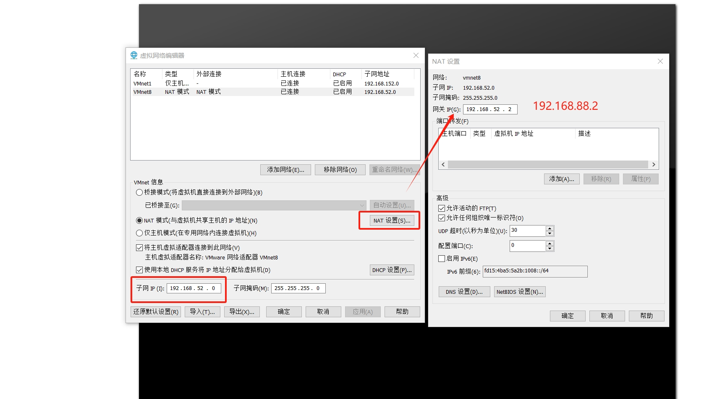

# Linux 操作

## 安装VMWare

1. 注册登录https://support.broadcom.com/group/ecx/productfiles

2. 进入

   

   然后进行下载

   

   下载完毕后安装，安装后遇到输入序列号时直接跳过，最后以个人使用即可

## Linux常用的命令：

###  文件操作

- 目录切换：

> ​	cd usr		切换到该目录下usr目录 	

> cd ../		切换到上一层目录

> cd /		切换到系统根目录

> cd ~		切换到用户主目录

> cd -		切换到上一个所在目录

- 查看目录： ls

- 查看所有文件及目录(包括隐藏的)： ls -a

- 该目录下所有目录和文件的详细信息:ls -l  可以显示出文件的权限：
```

如：drwxr-xr-x   对应的是：文件类型，读取权，写入权，执行权
d：代表目录
-：代表文件
l：代表链接（可以认为是window中的快捷方式）

后面的9位分为3组，每3位置一组，分别代表属主的权限，与当前用户同组的	用户的权限，其他用户的权限

r：代表权限是可读，r也可以用数字4表示

w：代表权限是可写，w也可以用数字2表示

x：代表权限是可执行，x也可以用数字1表示
```
- 查找目录：find 目录 参数

-  查找文件： find / -name file1 从“/” 开始进入根文件系统查找文件和目录

- 修改目录名称(包括压缩包)：mv 目录名称 新目录名称


- 移动目录：mv 目录名称 目录的新位置

- 创建一个目录 ：mkdir 目录名       

- 创建目录：mkdir -pv  ./abc/123:创建层级目录

- 删除目录：rm  目录 都可直接使用 rm -rf 目录/文件/压缩包

- 强制删除文件：rm -f ./xxx.x

- 文件创建： touch 文件名称 touch aaa.txt

- 文件查看：cat/more/less/tail 文件

- 编辑文件：vim  /etc/profile     底行输入:wq退出并保存

- 解压缩：
```
tar命令  -c 是压缩
-x是解压
-z是否需要解压gzip压缩
-v压缩过程中显示文件
-f 使用档名在f 之后立即接档名
```
- ​		压缩：tar -zcvf xxx.tar ./目标文件目录

- ​		解压：tar -zxvf 文件名

- ​		解压到指定目录： tar -zxvf xx.tar.gz -C /目录


### 网络操作

**查看ip:**  `ifconfig`    `ip addr`

**查看日志** ： `tail -f xxx.log`

#### 配置固定的ip和主机名称

1. 设置VMWare的虚拟网络的网段

   ```
   # 网段设置为192.168.88.0
   # 网关设置为192.168.88.2
   ```

   

   

   

2. 配置固定ip

```
#修改主机名称
hostsnamectl set-hostname node1;
# 修改IP地址(网卡配置文件)
vim /etc/sysconfig/network-scripts/ifcfg-ens33
 # 修改BOOTPROTO属性原始为dhcp
 BOOTPROTO="static"
 #增加一下静态地址
 IPADDR = "192.168.88.131"
 # 增加mask,网关，dns
 NETMASK="255.255.255.0"
 GATEWAY="192.168.88.2" # 与虚拟机配置有关
 DNS1="192.168.88.2" 
#重启网卡
systemctl restart network
```


### 防火墙相关

默认防火墙是关闭状态，关于防火墙操作如下

```
# 开启防火墙
sudo systemctl start firewalld

# 关闭防火墙
sudo systemctl stop firewalld
# 关闭防火墙开机自启
sudo systemctl disable firewalld

# 查看防火墙状态
sudo systemctl status firewalld

# 增加开放端口
sudo firewall-cmd --add-port=端口号/协议
sudo firewall-cmd --add-port=80/tcp

# 删除开放的端口
sudo firewall-cmd --remove-port=端口号/协议

# 列出防火墙规则
sudo firewall-cmd --list-all

# 列出防火墙所开放所有的的端口
sudo firewall-cmd --list-ports

# 列出指定区域开放的端口
sudo firewall-cmd --zone=public --list-ports

# 重新加载防火墙配置
sudo firewall-cmd --reload
```


```
# 检查防火墙
iptables -L
```

#### SELinux

selinux是用以限制用户和程序的相关权限，确保系统的安全稳定的。

```
vim /etc/sysconfig/selinux

# 将SELINUX=enforcing改为
SELINUX=disabled

# init 6 命令进行重启
init 6 
```

### 用户,用户组操作相关

```
# 查看是否存在用户
cat /etc/passwd | grep user1

# 增加用户并设置密码
sudo useradd -d /home/ftpuser -s /bin/false ftpuser
sudo passwd ftpuser
# 删除用户
sudo userdel 用户名

# 修改用户密码
usermod -p  用户名

#切换相应的用户
su - root

# 设置用户组
groupadd 组名

# 修改用户组名
groupmod -n newgroupname 组名

# 删除用户组
groupdel 组名

# 查看用户组
cat /etc/group

# 将用户添加到组名
usermod -aG 组名 用户名

#更改用户shell 
chsh [选项] 用户名
```

###  时区和自动时间同步配置

```
# 1. 按照ntp软件
yum install -y ntp
# 2.更新时区
rm -rf /etc/localtime;
sudo ln -s /usr/share/zoneinfo/Asia/Shanghai /etc/localtime
# 查看时间
date
# 3.同步时间 校准
ntpdate -u ntp.aliyun.com
# 4.开启服务并开机自启
systemctl start ntpd
systemctl enable ntpd
```


## Ubuntu下操作

### 安装jdk:

当使用这个命令安装时：

`wget  http://download.oracle.com/otn-pub/java/jdk/8u181-b13/96a7b8442fe848ef90c96a2fad6ed6d1/jdk-8u181-linux-x64.tar.gz`

​	会报错：gzip: stdin: not in gzip format 
​	tar: Child returned status 1 
​	tar: Error is not recoverable: exiting now 

需要加上： `--no-check-certificate --no-cookies --header "Cookie: oraclelicense=accept-securebackup-cookie"`因为oracle公司要你接受同意没如果直接不带头格式下载后不能解压：

所以用以下方式就可以了：

```
wget --no-check-certificate --no-cookies --header "Cookie: oraclelicense=accept-securebackup-cookie" http://download.oracle.com/otn-pub/java/jdk/8u181-b13/96a7b8442fe848ef90c96a2fad6ed6d1/jdk-8u181-linux-x64.tar.gz
```

**解压**：`tar -zxvf jdk-8u181-linux-x64.tar.gz`

#### **jdk环境配置：**

`vim /etc/profile`
方式一
```
export JAVA_HOME=/java/jdk1.8.0_181
export CLASSPATH=JAVA_HOME/lib/
export PATH=PATH:$JAVA_HOME/bin
export PATH JAVA_HOME CLASSPATH
```
方式二
```
export JAVA_HOME=/root/java/jdk1.8.0_181
export JRE_HOME=$JAVA_HOME/jre
exportCLASSPATH=.:$JAVA_HOME/lib:$JRE_HOME/lib:$CLASSPATH
export PATH=$JAVA_HOME/bin:$JRE_HOME/bin:$PATH
```
方式三
```
export JAVA_HOME=/usr/local/src/java/jdk1.7.0_71
export CLASSPATH=.:$JAVA_HOME/lib.tools.jar
export PATH=$JAVA_HOME/bin:$PATH
export export JAVA_HOME CLASSPATH PATH
```
点击esc等下面的insert发生变化输入:qw保存并退出

保存生效：`source /etc/profile`

重启机器：`sudo shutdown -r now`

输入查看是否生效：`javac -version`

卸载.gz：`rm -rf /java/ jdk-8u181-linux-x64.tar.gz`

### 安装tomcat：

地址去官网看Tomcat的liunx版本的下载的链接直接使用命令

```
wget http://mirrors.shu.edu.cn/apache/tomcat/tomcat-9/v9.0.12/bin/apache-tomcat-9.0.12.tar.gz
```

解压：`tar zxvf  apache-tomcat-9.0.12.tar.gz;`

配置Tomcat环境：

`编辑文件：vim  /etc/profile` 
```
export CATALINA_HOME=/root/java/apache-tomcat-9.0.16
export CATALINA_HOME
```
点击esc等下面的insert发生变化输入:qw保存并退出

启用配置文件：`source /etc/profile`

查看Tomcat的环境 ：echo  CATALINA_HOME

启动tomcat ：`cd /java/ apache-tomcat-9.0.12/bin` 执行常用命令：`./startup.sh`启动

或者使用： `sudo service apache-tomcat-9.0.12 start `   //启动  
`sudo service apache-tomcat-9.0.12 restart`  //重启  
 `sudo service apache-tomcat-9.0.12 stop `    //停止  
卸载：`sudo apt-get autoremove  apache-tomcat-9.0.12 `


这样就可以直接访问了8080断就就可以直接访问了

### 安装mysql:

查看自带mysql输入 `rpm -qa | grep mysql`

或者 ： `sudo netstat -tap | grep mysql`

在 Ubuntu 16.04 中，默认情况下，只有最新版本的 MySQL 包含在 APT 软件包存储库中。在撰写本文时，那是 MySQL 5.7要安装它，只需更新服务器上的包索引并安装默认包 apt-get。

#### 安装执行以下命令：


> sudo apt-get update
> sudo apt-get install mysql-server

然后等待下载。配置密码

[](https://imgchr.com/i/DS0PaR)

再次验证：

[](https://imgchr.com/i/DS0kPx)

这样的等待完成安装即可。

#### 配置远程连接

编辑 ： `/etc/mysql/mysql.conf.d/mysqld.cnf`

将`bind-address = 127.0.0.1`修改为`bind-address = 0.0.0.0`

加入：`character-set-server=utf8`使其使用utf-8编码

[](https://imgchr.com/i/DS0VxO)

重新启动并登陆mysql:
```
	sudo service mysql restart

​	mysql -uroot -p
```
修改权限：

`GRANT ALL PRIVILEGES ON *.* TO 'root'@'%' IDENTIFIED BY 'yourpassword' WITH GRANT OPTION;`

`FLUSH PRIVILEGES`;

[](https://imgchr.com/i/DS0KZd)

重新启动mysql: `sudo service mysql restart`
注意：有时重启服务器后mysql未启动导致远程无法连接只需启动mysql`sudo service mysql start`这样就可以直接连接了


**卸载mysql:**
```
			sudo apt purge mysql-*
​			sudo rm -rf /etc/mysql/ /var/lib/mysql
​			sudo apt autoremove
​			sudo apt autoreclean
```
安装mysql5.5：wget http://dev.mysql.com/get/Downloads/MySQL-5.5/mysql-5.5.46-linux2.6-x86_64.tar.gz

配置和上面的一致即可。

## CentOS下操作：

### VMware 安装centos7

安装完毕后配置使用yum install 报错


修改配置vi /etc/yum.repos.d/CentOS-Base.repo 

```
[base]
name=CentOS-$releasever - Base
baseurl=http://mirrors.aliyun.com/centos/7/os/$basearch/
gpgcheck=1
gpgkey=http://mirrors.aliyun.com/centos/RPM-GPG-KEY-CentOS-7

[updates]
name=CentOS-$releasever - Updates
baseurl=http://mirrors.aliyun.com/centos/7/updates/$basearch/
gpgcheck=1
gpgkey=http://mirrors.aliyun.com/centos/RPM-GPG-KEY-CentOS-7

[extras]
name=CentOS-$releasever - Extras
baseurl=http://mirrors.aliyun.com/centos/7/extras/$basearch/
gpgcheck=1
gpgkey=http://mirrors.aliyun.com/centos/RPM-GPG-KEY-CentOS-7
```

### 安装网络工具

```
sudo yum install net-tools
```

`net-tools` 是一个包含多个网络管理工具的软件包，这些工具主要用于配置和管理网络接口。以下是一些 `net-tools` 包中包含的主要工具及其功能：

1. **ifconfig**: 用于配置和显示网络接口的详细信息，如IP地址、子网掩码、广播地址等。
2. **route**: 用于显示和操作IP路由表。
3. **netstat**: 用于显示网络连接、路由表、接口统计信息、伪装连接、多播成员等信息。
4. **arp**: 用于显示和修改系统的ARP缓存。
5. **rarp**: 用于显示和修改系统的RARP缓存（RARP是一种旧的协议，用于将MAC地址映射到IP地址）。
6. **nameif**: 用于根据MAC地址配置网络接口的名称。
7. **iptunnel**: 用于配置IP隧道。
8. **mii-tool**: 用于查看和配置网络接口的MII（媒体独立接口）状态。

虽然 `net-tools` 包提供了许多有用的网络管理工具，但在现代Linux系统中，许多功能已经被 `iproute2` 包中的工具所取代。例如，`ip` 命令可以替代 `ifconfig` 和 `route` 命令，`ss` 命令可以替代 `netstat` 命令。

### 安装jdk

```
wget --no-check-certificate --no-cookies --header "Cookie: oraclelicense=accept-securebackup-cookie" http://download.oracle.com/otn-pub/java/jdk/8u181-b13/96a7b8442fe848ef90c96a2fad6ed6d1/jdk-8u181-linux-x64.tar.gz
```

但是这个方式总是被限制不如直接去上传一个tar包。解压后配置环境变量。

`vim /etc/profile`

```
	export JAVA_HOME=/usr/local/src/java/jdk1.8.0_181
	export CLASSPATH=.:$JAVA_HOME/lib.tools.jar
	export PATH=$JAVA_HOME/bin:$PATH
	export export JAVA_HOME CLASSPATH PATH
```

保存生效：`source /etc/profile`

重启机器：`sudo shutdown -r now`

输入查看是否生效：`javac -version`

### 安装mysql

一般网上给出的资料都是

```
#yum install mysql
#yum install mysql-server
#yum install mysql-devel
```

安装mysql和mysql-devel都成功，但是安装mysql-server失败，如下：

[root@localhost src]# yum install mysql-server
已加载插件：fastestmirror, product-id, search-disabled-repos, subscription-manager

This system is not registered with an entitlement server. You can use subscription-manager to register.

Loading mirror speeds from cached hostfile
 * base: mirrors.163.com
 * extras: mirrors.163.com
 * updates: mirrors.163.com
    没有可用软件包 mysql-server。
    错误：无须任何处

处理方式 

#### 安装方式一：安装MaraiDB

MariaDB数据库管理系统是MySQL的一个分支，主要由开源社区在维护，采用GPL授权许可。开发这个分支的原因之一是：甲骨文公司收购了MySQL后，有将MySQL闭源的潜在风险，因此社区采用分支的方式来避开这个风险。MariaDB的目的是完全兼容MySQL，包括API和命令行，使之能轻松成为MySQL的代替品。

安装mariadb，大小59 M。

```
yum install mariadb-server mariadb 
```

mariadb数据库的相关命令是：
```
systemctl start mariadb  #启动MariaDB

systemctl stop mariadb  #停止MariaDB

systemctl restart mariadb  #重启MariaDB

systemctl enable mariadb  #设置开机启动
```
所以先启动数据库

```
systemctl start mariadb
```

这时候是没有密码的：

[](https://imgchr.com/i/DS68Wn)

#### 安装方式二直接下载：

使用wget命令直接下载

```
wget http://dev.mysql.com/get/Downloads/MySQL-5.6/MySQL-5.6.22-1.el6.i686.rpm-bundle.tar
```

1、 mkdir /usr/local/src/mysql

2、 cd /usr/local/src/mysql

3    tar -xvf MySQL-5.6.22-1.el6.i686.rpm-bundle.tar

4.安装server: `rpm -ivh MySQL-server-5.6.22-1.el6.i686.rpm`

出现问题，需要安装依赖：`yum -y install libaio.so.1 libgcc_s.so.1 libstdc++.so.6`

[](https://imgchr.com/i/DSffTf)

再安装：` yum install net-tools `

[](https://imgchr.com/i/DSWnUO)

升级： `yum  update libstdc++-4.4.7-4.el6.x86_64`

再进行对其执行安装命令：

[](https://imgchr.com/i/DSfH6s)

5.安装client   rpm -ivh MySQL-client-5.6.22-1.el6.i686.rpm 

出现问题：先安装： `yum -y install libncurses.so.5 libtinfo.so.5`

[](https://imgchr.com/i/DSWi8J)

​	

再进行对其执行安装命令：

这样就结束了安装：

1、 使用密码登录mysql账号：mysql -uroot -p

2、 修改root密码：SET PASSWORD = PASSWORD('123456');

#### 配置mysql

- 加入到系统服务：`chkconfig --add mysql`

- 自动启动：`chkconfig mysql on`


- 查询列表：`chkconfig`


设置远程访问（使用root密码）：
```
grant all privileges on *.* to 'root' @'%' identified by '123456'; 

flush privileges;
```
防火墙打开3306端口
```
> /sbin/iptables -I INPUT -p tcp --dport 3306 -j ACCEPT
>
> /etc/rc.d/init.d/iptables save
>
> /etc/init.d/iptables status
```
### 安装tomcat

直接上传 然后解压
配置Tomcat环境：

`编辑文件：vim  /etc/profile` 
```
export CATALINA_HOME=/root/java/apache-tomcat-9.0.16
export CATALINA_HOME
```
点击esc等下面的insert发生变化输入:qw保存并退出

启用配置文件：`source /etc/profile`

查看Tomcat的环境 ：echo  CATALINA_HOME

启动tomcat ：`cd /java/ apache-tomcat-9.0.12/bin` 执行常用命令：`./startup.sh`启动

或者使用： `sudo service apache-tomcat-9.0.12 start `   //启动  
`sudo service apache-tomcat-9.0.12 restart`  //重启  
 `sudo service apache-tomcat-9.0.12 stop `    //停止  
卸载：`sudo apt-get autoremove  apache-tomcat-9.0.12 `


这样就可以直接访问了8080断就就可以直接访问了
### 安装 maven

```bash
wget https://mirrors.cnnic.cn/apache/maven/maven-3/3.5.4/binaries/apache-maven-3.5.4-bin.tar.gz --no-check-certificate
```

解压： tar -zxvf   apache-maven-3.5.4-bin.tar.gz

建立软连接： ln -s /usr/local/maven/bin/mvn  /usr/bin/mvn

配置环境变量：**vim /etc/profile**

```bash
export MAVEN_HOME=/usr/local/src/java/apache-maven-3.5.4
export PATH=$MAVEN_HOME/bin:$PATH
```

保存生效： **source /etc/profile**

查看 **mvn -version**

```bash
[root@localhost java]# mvn -version
Apache Maven 3.5.4 (1edded0938998edf8bf061f1ceb3cfdeccf443fe; 2018-06-18T02:33:14+08:00)
Maven home: /usr/local/src/java/apache-maven-3.5.4
Java version: 1.8.0_181, vendor: Oracle Corporation, runtime: /usr/local/src/java/jdk1.8.0_181/jre
Default locale: zh_CN, platform encoding: UTF-8
OS name: "linux", version: "3.10.0-1127.el7.x86_64", arch: "amd64", family: "unix"
[root@localhost java]# 
```

### 安装apache 服务

1. 安装apache

   ```
   yum -y install httpd
   安装完成后
   #主配置文件 /etc/httpd/conf/httpd.conf
   
   #默认网网站家目录 /var/www/html
   systemctl start httpd
   什么都不改的情况下需要在html下一级建一个目录doc 将文件上传访问
   访问  ip:port/doc/
   
   ```

2. 增加认证

   ```
   1. 新建认证文件 并输入密码
   sudo htpasswd -c /etc/httpd/.htpasswd apm 
   2. 如果是在某一个目录下需要认证，则此次目录新建一个文件.htaccess 文件内容如下
   AuthName "apm"
   AuthType Basic
   AuthUserFile /etc/httpd/.htpasswd
   require user apm
   3. 在/etc/httpd/conf/httpd.conf 进行配置访问的目录的认证
   <Directory "/var/www/html/doc/">
       Options Indexes
       AllowOverride AuthConfig
       Order allow,deny
       Allow from all
   </Directory>
   4 重启服务
   ```

### 安装ftp

1. 下载

   ```
   # 下载
   yum -y install vsftpd
   # 查看状态
   systemctl status vsftpd
   ```

2. 配置文件

   ```
   vim /etc/vsftpd/vsftpd.conf
   
   
   
   anonymous_enable=NO #禁止匿名用户登录
   local_enable=YES #允许本地用户登录
   write_enable=YES #允许用户上传文件
   chroot_local_user=YES #将用户限制在其主目录下
   user_sub_token=$USER #为每个用户创建独立的目录
   local_root=/home/$USER/ftp # FTP用户主目录
   pasv_min_port=40000 #被动模式最小端口号
   pasv_max_port=50000 #被动模式最大端口号
   listen_port=8825 #更改端口号
   
   ```

3. 更改根目录


1. 更改防火墙配置

```
sudo firewall-cmd --add-port=8825/tcp
```

### 跨服务器传输文件

#### rcp 命令

rcp指令用在远端复制文件或目录，如同时指定两个以上的文件或目录，且最后的目的地是一个已经存在的目录，则它会把前面指定的所有文件或目录复制到该目录中。

```
rcp [-pr][源文件或目录][目标文件或目录]
```

-p 　保留源文件或目录的属性，包括拥有者，所属群组，权限与时间。

-r 　递归处理，将指定目录下的文件与子目录一并处理。

```
rcp root@218.6.132.5:./testfile testfile  #复制远程文件到本地  
rcp root@218.6.132.5:home/rootlocal/testfile testfile  
```


#### scp 命令

scp 是 secure copy 的缩写, scp 是 linux 系统下基于 ssh 登陆进行安全的远程文件拷贝命令。

scp 是加密的，[rcp](https://www.runoob.com/linux/linux-comm-rcp.html) 是不加密的，scp 是 rcp 的加强版

```
scp [-1246BCpqrv] [-c cipher] [-F ssh_config] [-i identity_file]
[-l limit] [-o ssh_option] [-P port] [-S program]
[[user@]host1:]file1 [...] [[user@]host2:]file2
```

**参数说明：**

- -1： 强制scp命令使用协议ssh1
- -2： 强制scp命令使用协议ssh2
- -4： 强制scp命令只使用IPv4寻址
- -6： 强制scp命令只使用IPv6寻址
- -B： 使用批处理模式（传输过程中不询问传输口令或短语）
- -C： 允许压缩。（将-C标志传递给ssh，从而打开压缩功能）
- -p：保留原文件的修改时间，访问时间和访问权限。
- -q： 不显示传输进度条。
- -r： 递归复制整个目录。
- -v：详细方式显示输出。scp和ssh(1)会显示出整个过程的调试信息。这些信息用于调试连接，验证和配置问题。
- -c cipher： 以cipher将数据传输进行加密，这个选项将直接传递给ssh。
- -F ssh_config： 指定一个替代的ssh配置文件，此参数直接传递给ssh。
- -i identity_file： 从指定文件中读取传输时使用的密钥文件，此参数直接传递给ssh。
- -l limit： 限定用户所能使用的带宽，以Kbit/s为单位。
- -o ssh_option： 如果习惯于使用ssh_config(5)中的参数传递方式，
- -P port：注意是大写的P, port是指定数据传输用到的端口号
- -S program： 指定加密传输时所使用的程序。此程序必须能够理解ssh(1)的选项

##### 从本地复制到远程

**复制文件**

```
scp local_file remote_username@remote_ip:remote_folder 
或者 
scp local_file remote_username@remote_ip:remote_file 
或者 
scp local_file remote_ip:remote_folder 
或者 
scp local_file remote_ip:remote_file 
```

- 第1,2个指定了用户名，命令执行后需要再输入密码，第1个仅指定了远程的目录，文件名字不变，第2个指定了文件名；
- 第3,4个没有指定用户名，命令执行后需要输入用户名和密码，第3个仅指定了远程的目录，文件名字不变，第4个指定了文件名；

**复制目录**

```
scp -r local_folder remote_username@remote_ip:remote_folder 
或者 
scp -r local_folder remote_ip:remote_folder 
```

- 第1个指定了用户名，命令执行后需要再输入密码；
- 第2个没有指定用户名，命令执行后需要输入用户名和密码；


#### 从远程复制到本地

**复制文件**

```
scp remote_username@remote_ip:remote_folder local_file  
或者 
scp remote_username@remote_ip:remote_file  local_file 
或者 
scp remote_ip:remote_folder  local_file 
或者 
scp remote_ip:remote_file  local_file 
```

- 第1,2个指定了用户名，命令执行后需要再输入密码，第1个仅指定了远程的目录，文件名字不变，第2个指定了文件名；
- 第3,4个没有指定用户名，命令执行后需要输入用户名和密码，第3个仅指定了远程的目录，文件名字不变，第4个指定了文件名；

**复制目录**

```
scp -r remote_username@remote_ip:remote_folder  local_folder 
或者 
scp -r remote_ip:remote_folder  local_folder 
```

- 第1个指定了用户名，命令执行后需要再输入密码；
- 第2个没有指定用户名，命令执行后需要输入用户名和密码；

## 利用putty来链接服务器传输文件和操作：

​	去官网直接下载：https://www.chiark.greenend.org.uk/~sgtatham/putty/latest.html

​    下载后：点击putty.exe 然后把你的实例的公网IP地址输入就可以直接连上去操作了：

### 打开psftp:

​	首先需要登陆远程服务器：open hostname  然后输入用户名和密码login，进入之后就是类似于 linux的shell命令 比如 `pwd ls cd put get`

​	由于是远程登陆， 涉及到remote 和local两个工作路径

> cd ls pwd 这一套都是remote的
> local的就在前面加l前缀，比如 lcd lls lpwd都是local的
> put filename 用于把本地当前路劲的filename文件上传到remote的当前路径
> get filename 用于把remote的当前路径的filename文件下载到local的当前路径

### 文件操作

用命令行的形式上传到服务器：本地目录--->目标目录

上传单个：put E:/node/chrunlee/app.js /home/ubuntu/app.js 

上传目录：put -r E:/源数据代码/love  /java/love直接上传到 /java/apache-tomcat-9.0.12/webapps/love这样就可以直接访问了

移动文件的命令：mv love /java/apache-tomcat-9.0.12/webapps;这样就可以直接访问：

上传文件或者文件夹时要把上传到目标文件中带上你需要上传的文件名：put -r E:/源数据代码/love  /java/love;如果不带的话就会把文件夹中的所有文件放到java目录下了

​	你可以通过命令来查看你的webapps下面有多少文件及目录: cd /java/apache-tomcat-9.0.12/webapps --->然后命令 ls 就可以看到目录下有多少文件了：同样可以直接用putty把软件给传输到你的服务器中

apache存储目录：
```
		var/www/execise
​		var/www/stuResource
```
spring boot 后台运行命令：
```
nohup java -jar portal.jar > /root/java/log/portal_log.log 2>&1 &
```
下载的所有的应用程序安装必须放在：usr/local目录下


