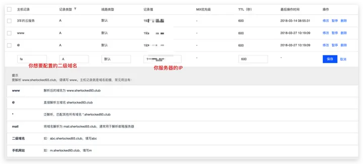
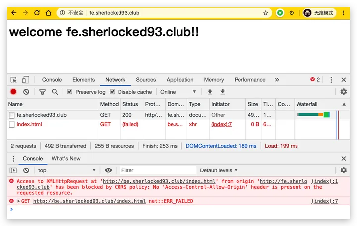
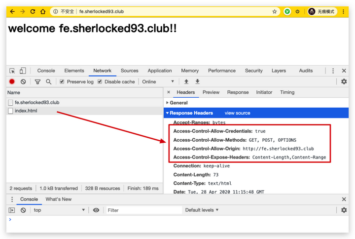

## Nginx

 ### 代理： 

 代理服务器，客户机在发送请求时，不会直接发送给目的主机，而是先发送给代理服务器，代理服务接受客户机请求之后，再向主机发出，并接收目的主机返回的数据，存放在代理服务器的硬盘中，再发送给客户机。

#### 正向代理：

正向代理，架设在客户机与目标主机之间，只用于代理内部网络对 Internet 的连接请求，客户机必须指定代理服务器,并将本来要直接发送到 Web 服务器上的 Http 请求发送到代理服务器中。

 #### 反向代理：

反向代理服务器架设在服务器端，通过缓冲经常被请求的页面来缓解服务器的工作量，将客户机请求转发给内部网络上的目标服务器；并将从服务器上得到的结果返回给 Internet 上请求连接的客户端，此时代理服务器与目标主机一起对外表现为一个服务器。**反向代理代理的是服务端**

### 虚拟主机：

​        虚拟主机是一种特殊的软硬件技术，它可以将网络上的每一台计算机分成多个虚拟主机，每个虚拟主机可以独立对外提供 www 服务，这样就可以实现一台主机对外提供多个 web 服务，每个虚拟主机之间是独立的，互不影响的。

通过 Nginx 可以实现虚拟主机的配置，Nginx 支持三种类型的虚拟主机配置

- 基于 IP 的虚拟主机
- 基于域名的虚拟主机
- 基于端口的虚拟主机

### nginx的使用：

​	Nginx 是一款高性能的 HTTP 服务器/反向代理服务器及电子邮件（IMAP/POP3）代理服务器。由俄罗斯的程序设计师 Igor Sysoev 所开发，官方测试 Nginx 能够支支撑 5 万并发链接，并且 CPU、内存等资源消耗却非常低，运行非常稳定。

​	Nginx既可以在内部的直接支持Rails和PHP程序对外进行服务,也可以支持HTTP代理服务对外进行服务，采用C语言编写,处理静态文件，索引文件以及自动索引;打开文件描述符缓冲。无缓存的反向代理加速，简单的负载均衡和容错。FastCGI，简单的负载均衡和容错。模块化的结构。包括 gzipping, byte ranges, chunked responses,以及 SSI-filter 等 filter。如果由 FastCG或其它代理服务器处理单页中存在的多个 SSI，则这项处理可以并行运行，而不需要相互等待。支持 SSL 和 TLSSNI。

  ####  Nginx 的应用场景

- HTTP 服务器：Nginx 是一个 HTTP 服务可以独立提供 HTTP 服务。可以做网页静态服务器。

- 虚拟主机：可以实现在一台服务器虚拟出多个网站。例如个人网站使用的虚拟主机。

- 反向代理，负载均衡：当网站的访问量达到一定程度后，单台服务器不能满足用户的请求时，需要用多台服务器集群可以使用 Nginx 做反向代理。并且多台服务器可以平均分担负载，不会因为某台服务器负载高宕机而某台服务器闲置的情况 .

  负载均衡，英文名称为 Load Balance，其意思就是分摊到多个操作单元上进行执行，例如 Web 服务器、FTP 服务器、企业关键应用服务器和其它关键任务服务器等，从而共同完成工作任务

##### 1.docker-compose.yml来使用nginx:

```yaml
version: '3.1'
  services:
  nginx:
    restart: always
    image: nginx
    container_name: nginx
    ports:
      - 81:80
    volumes:
      - ./conf/nginx.conf:/etc/nginx/nginx.conf
      - ./wwwroot:/usr/share/nginx/wwwroot
 # 配置nginx的数据卷：
  在dokcer文件下创建：nginx的目录下创建：nginx.conf文件：
  在当前目录创建wwwroot目录
  这里直接书写为
  /usr/local/dokcer/nginx/conf/nginx.conf
  /usr/local/dokcer/nginx/wwwroot
  在nginx.conf目录配置nginx的虚拟主机：
```

##### 2.nginx中使用虚拟主机配置：

需求

Nginx 对外提供 80 和 8080 两个端口监听服务

请求 80 端口则请求 html80 目录下的 html

请求 8080 端口则请求 html8080 目录下的 html

###### **创建目录及文件**

在 /usr/local/docker/nginx/wwwroot 目录下创建 html80 和 html8080 两个目录，并分辨创建两个 index.html 文件

```yml
# 配置虚拟主机
修改 /usr/local/docker/nginx/conf 目录下的 nginx.conf 配置文件：
worker_processes  1;

events {
	worker_connections  1024;
}

http {
	include       mime.types;
	default_type  application/octet-stream;

	sendfile        on;

		keepalive_timeout  65;
	# 配置虚拟主机 192.168.75.145
    server {
		# 监听的ip和端口，配置 192.168.75.145:80
		listen       80;
		# 虚拟主机名称这里配置ip地址
		server_name  192.168.75.145;
		# 所有的请求都以 / 开始，所有的请求都可以匹配此 location
		location / {
			# 使用 root 指令指定虚拟主机目录即网页存放目录
			# 比如访问 http://ip/index.html 将找到 /usr/local/docker/nginx/wwwroot/html80/index.html
			# 比如访问 http://ip/item/index.html 将找到 /usr/local/docker/nginx/wwwroot/html80/item/index.html

			root   /usr/share/nginx/wwwroot/html80;
				# 指定欢迎页面，按从左到右顺序查找
			index  index.html index.htm;
		}
	}
	# 配置虚拟主机 192.168.75.245
	server {
		listen       8080;
		server_name  192.168.75.145;

		  location / {
			root   /usr/share/nginx/wwwroot/html8080;
			index  index.html index.htm;
		  }
	}
}
    说明：这里的启动的端口必须和dockercompose中的nginx的启动端口一一对应：
    例如：这里有两个分别为8080和80那么port应这样写
    ports:
      - 80:80
      - 8080： 8080
    同时这里的location不能改变，改变的话也是改变对应的数据卷，其实就是这个文件映射到数据卷位置
    这里不需要改变只需改变html8000这个就可以：
    location / {
      root   /usr/share/nginx/wwwroot/html8080;
      index  index.html index.htm;
    }
```

###### 基于域名的虚拟主机配置

​	需求:两个域名指向同一台 Nginx 服务器，用户访问不同的域名显示不同的网页内容 两个域名是 admin.service.itoken.funtl.com 和 admin.web.itoken.funtl.comNginx 服务器使用虚拟机 192.168.75.145

**配置 Windows Hosts 文件**        

通过 host 文件指定 admin.service.itoken.funtl.com 和 admin.web.itoken.funtl.com 对应 192.168.75.145 虚拟机：
        修改 window 的 hosts 文件：（C:\Windows\System32\drivers\etc）

```
worker_processes  1;
events {
	worker_connections  1024;
}

http {
	include       mime.types;
	default_type  application/octet-stream;
	sendfile        on;
	keepalive_timeout  65;
	# 配置虚拟主机 192.168.75.145
​    server {
		# 监听的ip和端口，配置 192.168.75.145:80
		listen       80;
		# 虚拟主机名称这里配置ip地址
		server_name  www.kay.com;
		# 所有的请求都以 / 开始，所有的请求都可以匹配此 location
		location / {
			# 使用 root 指令指定虚拟主机目录即网页存放目录
			# 比如访问 http://ip/index.html 将找到 					 /usr/local/docker/nginx/wwwroot/html80/index.html
			# 比如访问 http://ip/item/index.html 将找到 /usr/local/docker/nginx/wwwroot/html80/item/index.html
			root   /usr/share/nginx/wwwroot/html80;
			# 指定欢迎页面，按从左到右顺序查找
​            index  index.html index.htm;
​        }
​    }
	# 配置虚拟主机 192.168.75.245
	server {
	   listen       8080;
	   server_name  192.168.75.145;
		location / {
			root   /usr/share/nginx/wwwroot/html8080;
			index  index.html index.htm;
		}
	}
}
通过 host 文件指定 admin.service.itoken.funtl.com 和 admin.web.itoken.funtl.com 对应 192.168.75.145 虚拟机：
这样通过域名即可访问：
# 创建目录及文件
在 /usr/local/docker/nginx/wwwroot 目录下创建 htmlservice 和 htmlweb 两个目录，并分辨创建两个 index.html 文件
# 配置虚拟主机

user  nginx;
worker_processes  1;

events {
	worker_connections  1024;
}

http {
	include   mime.types;
    default_type  application/octet-stream;
    sendfile        on;
    keepalive_timeout  65;
    server {
    	listen       80;
      	server_name  admin.service.itoken.funtl.com;
      	location / {
          	root   /usr/share/nginx/wwwroot/htmlservice;
          	index  index.html index.htm;
      	}
	}

    server {
		listen       80;
        server_name  admin.web.itoken.funtl.com;

       location / {
             root   /usr/share/nginx/wwwroot/htmlweb;
             index  index.html index.htm;
         }
    }                      
}
```

 ##### 3.使用nginx反向代理tomcat:

[](https://imgchr.com/i/Dk7kWj)

```yml
（1） 启动两个tomcat：在dokcer-compose.yml 编辑：
version: '3'
  services:
    tomcat1:
      image: tomcat
      container_name: tomcat1
      ports:
        - 9090:8080

    tomcat2:
      image: tomcat
      container_name: tomcat2
      ports:
        - 9091:8080

(2) local/docker/nginx/conf 目录下的 nginx.conf 配置文件：
user  nginx;
worker_processes  1;

events {
	worker_connections  1024;
}

http {
	include       mime.types;
	default_type  application/octet-stream;

	sendfile        on;

	keepalive_timeout  65;
	

	# 配置一个代理即 tomcat1 服务器

	upstream tomcatServer1 {
		server 192.168.75.145:9090;
	}

    #配置一个代理即 tomcat2 服务器

	upstream tomcatServer2 {
		server 192.168.75.145:9091;
	}
    # 配置一个虚拟主机
	server {
		listen 80;
		server_name admin.service.itoken.funtl.com;
		location / {
			#域名 admin.service.itoken.funtl.com 的请求全部转发到 tomcat_server1 即 tomcat1 服务上
			#可以直接书写tomcat的路径即可
			proxy_pass http://tomcatServer1;
			#欢迎页面，按照从左到右的顺序查找页面
			index index.jsp index.html index.htm;
		}
	}

	server {
		listen 80;
		server_name admin.web.itoken.funtl.com;
		location / {
			#域名 admin.web.itoken.funtl.com 的请求全部转发到 tomcat_server2 即 tomcat2 服务上
			proxy_pass http://tomcatServer2;
			index index.jsp index.html index.htm;
		}
	}
} 
 
（3）启动nginx在docker-compose.yml中配置：
version: '3'
  services:
    nexus:
      image: 'sonatype/nexus3'
      restart: always
      container_name: nexus
      ports:
        - '8081:8081'
      volumes:
        - '/usr/local/docker/nexus/data:/nexus-data'
    nignx:
      restart: always
      image: nginx
      container_name: nginx
      ports:
        - '8088:8088'
        - '9000:9000'
        - '80:80'
        - '/usr/local/docker/nginx/conf/nginx.conf:/etc/nginx/nginx.conf'
        - '/usr/local/docker/nginx/wwwroot:/usr/share/nginx/wwwroot'         
```

```

# 定义负载均衡设备的 Ip及设备状态 
upstream myServer {
    server 127.0.0.1:9090 down;
    server 127.0.0.1:8080 weight=2;
    server 127.0.0.1:6060;
    server 127.0.0.1:7070 backup;
}
```

- `upstream`：每个设备的状态:

- `down`：表示当前的 `server` 暂时不参与负载

- `weight`：默认为 1 `weight` 越大，负载的权重就越大。

- `max_fails`：允许请求失败的次数默认为 1 当超过最大次数时，返回 `proxy_next_upstream` 模块定义的错误

- `fail_timeout`:`max_fails` 次失败后，暂停的时间。

- `backup`：其它所有的非 `backup` 机器 `down` 或者忙的时候，请求 `backup` 机器。所以这台机器压力会最轻

  


 ##### 4.实战：

```xml
 在一个虚拟主机配置两个tomcat:
1.vim /etc/profile
    export CATALINA1_BASE="tomcat路径"
    export CATALINA1_HOME="tomcat路径"
    export Tomcat1Home=CATALINA1_BASE
    export CATALINA2_BASE="tomcat2路径"
    export CATALINA2_HOME="tomcat2路径"
    export Tomcat2Home=CATALINA2_BASE
2.在bin文件中修改 catalina.sh
在首行加入：
    export CATALINA1_BASE=CATALINA1_BASE
    export CATALINA1_HOME=CATALINA1_HOME
3.修改host：
    8005→9005
    8009→9009
    8080→9080
    8443→9443
4. ./startup.sh启动即可
```

#### Nginx安装

##### 常规安装( centos下）：

1.先安装gcc升级: `yum -y install make zlib zlib-devel gcc-c++ libtool  openssl openssl-devel`

[](https://imgchr.com/i/DkLrUf)

2.下载PCRE安装包： `wget http://downloads.sourceforge.net/project/pcre/pcre/8.35/pcre-8.35.tar.gz`。

[](https://imgchr.com/i/DkL0bt)

3.解压安装包：

```
[root@localhost src]# tar zxvf pcre-8.35.tar.gz 
```

4.编译安装：

```
[root@localhost pcre-8.35]# ./configure
[root@bogon pcre-8.35]# make && make install
```

5.查看pcre版本

```
[root@bogon pcre-8.35]# pcre-config --version
```

[](https://imgchr.com/i/DkLDVP)

6.下载安装nginx

`wget http://nginx.org/download/nginx-1.10.2.tar.gz`

7.进入nginx目录编译安装

```
[root@localhost nginx-1.10.2]# ./configure --prefix=/usr/local/webserver/nginx --with-http_stub_status_module --with-http_ssl_module --with-pcre=/usr/local/src/pcre-8.35
[root@localhost nginx-1.10.2]# make
[root@localhost nginx-1.10.2]# make install
```

8.查看版本：

```
[root@localhost nginx-1.10.2]# /usr/local/webserver/nginx/sbin/nginx -v
```

[](https://imgchr.com/i/DkOkMd)

**这里的配置使用的是webserver就是存放的文件的路径**

**关闭防火墙强：使其80端口开放：systemctl stop firewalld**

**访问：**

[](https://imgchr.com/i/DkjV4f)


##### 常规安装Ubuntu下：

1.先安装gcc : `sudo apt-get update`

2.安装 依赖库： 

`apt-get install zlib1g-dev`

`apt-get install openssl`

3.下载PCRE安装包： `wget http://downloads.sourceforge.net/project/pcre/pcre/8.35/pcre-8.35.tar.gz`。

[](https://imgchr.com/i/DkL0bt)

4.解压安装包：

```
[root@localhost src]# tar zxvf pcre-8.35.tar.gz 
```

5.编译安装：

```
[root@localhost pcre-8.35]# ./configure
[root@bogon pcre-8.35]# make && make install
```

6.查看pcre版本

```
[root@bogon pcre-8.35]# pcre-config --version
```

[](https://imgchr.com/i/DkLDVP)

7.下载安装nginx

`wget http://nginx.org/download/nginx-1.10.2.tar.gz`

8.进入nginx目录编译安装

```
[root@localhost nginx-1.10.2]# ./configure --prefix=/usr/local/webserver/nginx --with-http_stub_status_module --with-http_ssl_module --with-pcre=/usr/local/src/pcre-8.35
[root@localhost nginx-1.10.2]# make
[root@localhost nginx-1.10.2]# make install
```

9.查看版本：

```
[root@localhost nginx-1.10.2]# /usr/local/webserver/nginx/sbin/nginx -v
```

[](https://imgchr.com/i/DkOkMd)

**这里的配置使用的是webserver就是存放的文件的路径**

**关闭防火墙强：使其80端口开放：systemctl stop firewalld**

##### Docker安装Nginx

`docker pull nginx:latest`

运行容器

`docker run --name nginx-test -p 8080:80 -d nginx`

- **--name nginx-test**：容器名称。
- **-p 8080:80**： 端口进行映射，将本地 8080 端口映射到容器内部的 80 端口。
- **-d nginx**： 设置容器在在后台一直运行。

##### DockerCompose安装Nginx

```yaml
version: '3.1'
  services:
  nginx:
    restart: always
    image: nginx
    container_name: nginx
    ports:
      - 81:80
    volumes:
      - ./conf/nginx.conf:/etc/nginx/nginx.conf
      - ./wwwroot:/usr/share/nginx/wwwroot
 # 配置nginx的数据卷：
  在dokcer文件下创建：nginx的目录下创建：nginx.conf文件：
  在当前目录创建wwwroot目录
  这里直接书写为
  /usr/local/dokcer/nginx/conf/nginx.conf
  /usr/local/dokcer/nginx/wwwroot
  在nginx.conf目录配置nginx的虚拟主机：
```

**运行**：`docker-compose up`

#### Nginx命令：

##### windows下：

cmd 进入Nginx解压目录 执行以下命令

`start nginx` : 启动nginx服务

`nginx -s reload` ：修改配置后重新加载生效

`nginx -s reopen` ：重新打开日志文件 `nginx -t -c /path/to/nginx.conf` 测试nginx配置文件是否正确

`nginx -t`：验证配置是否正确

`nginx -V`：查看Nginx的版本号

`nginx -s stop`：快速停止或关闭Nginx

`nginx -s quit`：正常停止或关闭Nginx

##### linux下：

**启动**

`./nginx` 可跟后面的以下参数

```

-c </path/to/config> 为 Nginx 指定一个配置文件，来代替缺省的。路径应为绝对路径

-t 不运行，而仅仅测试配置文件。nginx 将检查配置文件的语法的正确性，并尝试打开配置文件中所引用到的文件。

-v 显示 nginx 的版本。

-V 显示 nginx 的版本，编译器版本和配置参数。
```

直接使用./nginx 进行启动。

​    **关闭：**

```
ps -aux|grep nginx
kill -9 nginx主进程号
```

**设置开机自启**

1.进入`/lib/systemd/system`

2.编辑nginx.service 文件 `vim nginx .service`

```
[Unit]
Description=nginx service
After=network.target 
   
[Service] 
Type=forking 
ExecStart=/usr/local/nginx/sbin/nginx
ExecReload=/usr/local/nginx/sbin/nginx -s reload
ExecStop=/usr/local/nginx/sbin/nginx -s quit
PrivateTmp=true 
   
[Install] 
WantedBy=multi-user.target
```

3.加入开机自启

```
systemctl enable nginx
```

4.服务状态：

```
# systemctl start nginx.service　         启动nginx服务

# systemctl stop nginx.service　          停止服务

# systemctl restart nginx.service　       重新启动服务

# systemctl list-units --type=service     查看所有已启动的服务

# systemctl status nginx.service          查看服务当前状态

# systemctl enable nginx.service          设置开机自启动

# systemctl disable nginx.service         停止开机自启动
```


### Nginx配置语法：

nginx 配置主要配置的是nginx.conf文件。

```text
main        # 全局配置，对全局生效
├── events  # 配置影响 Nginx 服务器或与用户的网络连接
├── http    # 配置代理，缓存，日志定义等绝大多数功能和第三方模块的配置
│   ├── upstream # 配置后端服务器具体地址，负载均衡配置不可或缺的部分
│   ├── server   # 配置虚拟主机的相关参数，一个 http 块中可以有多个 server 块
│   ├── server
│   │   ├── location  # server 块可以包含多个 location 块，location 指令用于匹配 uri
│   │   ├── location
│   │   └── ...
│   └── ...
└── ...
```

一个 Nginx 配置文件的结构就像 `nginx.conf` 显示的那样，配置文件的语法规则：

1. 配置文件由指令与指令块构成；
2. 每条指令以 `;` 分号结尾，指令与参数间以空格符号分隔；
3. 指令块以 `{}` 大括号将多条指令组织在一起；
4. `include` 语句允许组合多个配置文件以提升可维护性；
5. 使用 `#` 符号添加注释，提高可读性；
6. 使用 `$` 符号使用变量；
7. 部分指令的参数支持正则表达式；


```yaml
########### 每个指令必须有分号结束。#################
user  nginx;                        # 运行用户，默认即是nginx，可以不进行设置
worker_processes  1;                # Nginx 进程数，一般设置为和 CPU 核数一样
#user administrator administrators;  #配置用户或者组，默认为nobody nobody。
#worker_processes 2;  #允许生成的进程数，默认为1
pid /nginx/pid/nginx.pid;   #指定nginx进程运行文件存放地址
error_log log/error.log debug;  #制定日志路径，级别。这个设置可以放入全局块，http块，server块，级别以此为：debug|info|notice|warn|error|crit|alert|emerg
events {
    accept_mutex on;   #设置网路连接序列化，防止惊群现象发生，默认为on
    multi_accept on;  #设置一个进程是否同时接受多个网络连接，默认为off
    #use epoll;      #事件驱动模型，select|poll|kqueue|epoll|resig|/dev/poll|eventport
    worker_connections  1024;    #最大连接数，默认为512
}

http {
    include       mime.types;   #文件扩展名与文件类型映射表
    default_type  application/octet-stream; #默认文件类型，默认为text/plain
    #access_log off; #取消服务日志    
    # 设置日志模式
    log_format  main  '$remote_addr - $remote_user [$time_local] "$request" '
                      '$status $body_bytes_sent "$http_referer" '
                      '"$http_user_agent" "$http_x_forwarded_for"';
    access_log log/access.log main;  #combined为日志格式的默认值
    sendfile on;   #允许sendfile方式传输文件，默认为off，可以在http块，server块，location块。
    sendfile_max_chunk 100k;  #每个进程每次调用传输数量不能大于设定的值，默认为0，即不设上限。
    keepalive_timeout 65;  #连接超时时间，默认为75s，可以在http，server，location块。
 	tcp_nodelay         on;
    types_hash_max_size 2048;

    include             /etc/nginx/mime.types;      # 文件扩展名与类型映射表
    default_type        application/octet-stream;   # 默认文件类型

    include /etc/nginx/conf.d/*.conf;   # 加载子配置项
    # 反向代理的服务器配置(同时代理两个服务)
    upstream mysvr {
      ip_hash # 使用ip_hash进行权重
      server 127.0.0.1:7878 weight =2 ; # 使用权重
      server 127.0.0.1:7879 weight =1;
      server 192.168.10.121:3333 backup;  #热备
    }
    
    error_page 404 https://www.baidu.com; #错误页
    
    server {
        keepalive_requests 120; #单连接请求上限次数。
        listen       4545;   #监听端口
        server_name  127.0.0.1;   #监听地址       
        location  ~*^.+$ {       #请求的url过滤，正则匹配，~为区分大小写，~*为不区分大小写。
           #root path;  #根目录
           #index vv.txt;  #设置默认页
           proxy_pass  http://mysvr;  #请求转向mysvr 定义的服务器列表
           deny 127.0.0.1;  #拒绝的ip
           allow 172.18.5.54; #允许的ip           
        } 
    }
    
    server{
    	listen 9099;
        server_name  127.0.0.1;   #监听地址 
        # root 模式 指令指定的是服务器根目录，是用于处理HTTP请求时所使用的默认根目录。例如，若root  /root/www/home/;，则访问http://172.0.0.1/static/index.html会定位到/root/www/home/static/index.html文件。
        location  /static/ {       #请求的url过滤，正则匹配，~为区分大小写，~*为不区分大小写。
           root /root/www/home;  #服务器根目录 无需以/ 结束   会在 /home/static/ 下找文件
           index inde.html;  #设置默认页         
        }
        # alias 模式 指令指定的是实际文件存储位置，它指定的路径是将URL的字符串替换为实际路径。例如，若alias /root/www/home/;，则访问http://server_name  127.0.0.1/static/index.html会定位到/data/www/home/static/index.html文件
        location  /static/ {       
           alias /root/www/home/;  #实际文件存储的位置 alias 必须以 / 结束 直接在 home 下找文件
           index index.html;  #设置默认页         
        }
    }
}
```

server 块可以包含多个 location 块，location 指令用于匹配 uri，语法：

```text
location [ = | ~ | ~* | ^~] uri {
	...
}
```

指令后面：

1. `=` 精确匹配路径，用于不含正则表达式的 uri 前，如果匹配成功，不再进行后续的查找；
2. `^~` 用于不含正则表达式的 uri 前，表示如果该符号后面的字符是最佳匹配，采用该规则，不再进行后续的查找；
3. `~` 表示用该符号后面的正则去匹配路径，区分大小写；
4. `~*` 表示用该符号后面的正则去匹配路径，不区分大小写。跟 `~` 优先级都比较低，如有多个location的正则能匹配的话，则使用正则表达式最长的那个；

如果 uri 包含正则表达式，则必须要有 `~` 或 `~*` 标志。

#### Nginx 全局变量

Nginx 有一些常用的全局变量，你可以在配置的任何位置使用它们，如下表：

**全局变量名功能**


还有更多的内置预定义变量，可以直接搜索关键字「nginx内置预定义变量」可以看到一堆博客写这个，这些变量都可以在配置文件中直接使用。

### Nginx 设置二级域名虚拟主机

在某某云 ☁️ 上购买了域名之后，就可以配置虚拟主机了，一般配置的路径在 `域名管理 -> 解析 -> 添加记录` 中添加二级域名，配置后某某云会把二级域名也解析到我们配置的服务器 IP 上，然后我们在 Nginx 上配置一下虚拟主机的访问监听，就可以拿到从这个二级域名过来的请求了。



现在我自己的服务器上配置了一个 fe 的二级域名，也就是说在外网访问 `fe.sherlocked93.club` 的时候，也可以访问到我们的服务器了。

由于默认配置文件 `/etc/nginx/nginx.conf` 的 http 模块中有一句 `include /etc/nginx/conf.d/*.conf` 也就是说 `conf.d` 文件夹下的所有 `*.conf` 文件都会作为子配置项被引入配置文件中。为了维护方便，我在 `/etc/nginx/conf.d` 文件夹中新建一个 `fe.sherlocked93.club.conf` ：

```text
# /etc/nginx/conf.d/fe.sherlocked93.club.conf

server {
  listen 80;
	server_name fe.sherlocked93.club;

	location / {
		root  /usr/share/nginx/html/fe;
		index index.html;
	}
}
```

然后在 `/usr/share/nginx/html` 文件夹下新建 fe 文件夹，新建文件 `index.html`，内容随便写点，改完 `nginx -s reload` 重新加载，浏览器中输入 `fe.sherlocked93.club`，发现从二级域名就可以访问到我们刚刚新建的 fe 文件夹：


### Nginx 配置反向代理

1. 访问localhost:9000/baidu 转发道百度
2. 访问localhost:9000/bilibli 转发到bilibli

```conf
server {
  listen 9000;

  location ~ /baidu / {
    proxy_pass http://www.baidu.com;
  }
  
  location ~ /bilibli/ {
    proxy_pass http://www.blibli.com;
  }
  
  location /office/ {
    proxy_redirect off; 
    proxy_set_header X-Forwarded-Host $host:8829/office; 设置请求头header
    # proxy_pass末尾加 /是代表着会抛弃location的请求。 如：/office/web-api 实际请求就是http://172.16.30.33:11100/web-api
    # 如果proxy_pass中末尾没有/ 则代表着要把请求直接加到路径上如。/office/web-api 实际请求就是http://172.16.30.33:11100/office/web-api
    proxy_pass http://172.16.30.33:11100/;
  }
}
```

反向代理还有一些其他的指令，可以了解一下：

1. `proxy_set_header`：在将客户端请求发送给后端服务器之前，更改来自客户端的请求头信息；
2. `proxy_connect_timeout`：配置 Nginx 与后端代理服务器尝试建立连接的超时时间；
3. `proxy_read_timeout`：配置 Nginx 向后端服务器组发出 read 请求后，等待相应的超时时间；
4. `proxy_send_timeout`：配置 Nginx 向后端服务器组发出 write 请求后，等待相应的超时时间；
5. `proxy_redirect`：用于修改后端服务器返回的响应头中的 Location 和 Refresh。

### Nginx 跨域配置

#### 使用反向代理

在前端服务地址为 `localhost:9001` 的页面请求 `localhost:9002` 的后端服务导致的跨域，可以这样配置：

```
server {
  listen 9001;
  server_name localhost;

  location / {
    proxy_pass localhost::9002;
  }
}

server {
  listen 9002;
  server_name localhost;

  location / {
    proxy_pass 172.16.20.1:90000;
  }
}
```

这样就将对前一个域名 `localhost:9001` 的请求全都代理到了`localhost:9002`，前端的请求都被我们用服务器代理到了后端地址下，绕过了跨域。

这里对静态文件的请求和后端服务的请求都以 `fe.sherlocked93.club` 开始，不易区分，所以为了实现对后端服务请求的统一转发，通常我们会约定对后端服务的请求加上 `/apis/` 前缀或者其他的 path 来和对静态资源的请求加以区分，此时我们可以这样配置：

```text
# 请求跨域，约定代理后端服务请求path以/apis/开头
location ^~/apis/ {
    # 这里重写了请求，将正则匹配中的第一个分组的path拼接到真正的请求后面，并用break停止后续匹配
    rewrite ^/apis/(.*)$ /$1 break;
    proxy_pass localhost:9002;
  
    # 两个域名之间cookie的传递与回写
    proxy_cookie_domain localhost:9001 localhost:9002;
}
```

这样，静态资源我们使用 `localhost:9001/xx.html`，动态资源我们使用 `localhost:9001/apis/getAwo`，浏览器页面看起来仍然访问的前端服务器，绕过了浏览器的同源策略，毕竟我们看起来并没有跨域。

也可以统一一点，直接把前后端服务器地址直接都转发到另一个`server.sherlocked93.club`，只通过在后面添加的 path 来区分请求的是静态资源还是后端服务，看需求了。

#### 使用Header结局跨域

当浏览器在访问跨源的服务器时，也可以在跨域的服务器上直接设置 Nginx，从而前端就可以无感地开发，不用把实际上访问后端的地址改成前端服务的地址，这样可适性更高。

比如前端站点是 `fe.sherlocked93.club`，这个地址下的前端页面请求 `be.sherlocked93.club`下的资源，比如前者的 `fe.sherlocked93.club/index.html` 内容是这样的：

```text
<html>
<body>
    <h1>welcome fe.sherlocked93.club!!<h1>
    <script type='text/javascript'>
    var xmlhttp = new XMLHttpRequest()
    xmlhttp.open("GET", "http://be.sherlocked93.club/index.html", true);
    xmlhttp.send();
    </script>
</body>
</html>
```

打开浏览器访问 `fe.sherlocked93.club/index.html` 的结果如下：



很明显这里是跨域请求，在浏览器中直接访问 `http://be.sherlocked93.club/index.html` 是可以访问到的，但是在 `fe.sherlocked93.club` 的 html 页面访问就会出现跨域。

在 `/etc/nginx/conf.d/` 文件夹中新建一个配置文件，对应二级域名 `be.sherlocked93.club`：

```text
# /etc/nginx/conf.d/be.sherlocked93.club.conf

server {
  listen       80;
  server_name  be.sherlocked93.club;
  
	add_header 'Access-Control-Allow-Origin' $http_origin;   # 全局变量获得当前请求origin，带cookie的请求不支持*
	add_header 'Access-Control-Allow-Credentials' 'true';    # 为 true 可带上 cookie
	add_header 'Access-Control-Allow-Methods' 'GET, POST, OPTIONS';  # 允许请求方法
	add_header 'Access-Control-Allow-Headers' $http_access_control_request_headers;  # 允许请求的 header，可以为 *
	add_header 'Access-Control-Expose-Headers' 'Content-Length,Content-Range';
	
  if ($request_method = 'OPTIONS') {
		add_header 'Access-Control-Max-Age' 1728000;   # OPTIONS 请求的有效期，在有效期内不用发出另一条预检请求
		add_header 'Content-Type' 'text/plain; charset=utf-8';
		add_header 'Content-Length' 0;
    
		return 204;                  # 200 也可以
	}
  
	location / {
		root  /usr/share/nginx/html/be;
		index index.html;
	}
}
```

然后 `nginx -s reload` 重新加载配置。这时再访问 `fe.sherlocked93.club/index.html` 结果如下，请求中出现了我们刚刚配置的 Header：



解决了跨域问题。

### Nginx配置https

```
server {
	listen 443 ssl;
	server_name epcm.siiri.cn 
        
        ssl_certificate     /root/nginx/ssl_siiri_cn_nginx/scs1699680537939__.siiri.cn_server.crt;
        ssl_certificate_key   /root/nginx/ssl_siiri_cn_nginx/scs1699680537939__.siiri.cn_server.key;
        
        ssl_ciphers             HIGH:!aNULL:!MD5;
        ssl_protocols           TLSv1  TLSv1.1 TLSv1.2;
        ssl_prefer_server_ciphers on;
        location / {
         proxy_pass http://172.16.40.93:9488;
        }
        location /.well-know/acme-challenge/ {
           root /var/www/certbot;
        }
	
   }   
 server {
      listen 80;
      server_name epcm.siiri.cn;
      return 301 https://epcm.siiri.cn;
   }

```

前提是 DNs解析必须正确

然后进行重启 sudo nginx -s reload

### Nginx载均衡机制

主要的算法有：

1. `weight轮训(默认)`：接收到的请求按照顺序逐一分配到不同的后端服务器，如果某个服务器拓机的情况下，nginx会将其剔除队列，请求受理情况不会受到影响，可以给不同的后端服务配置权重值，用于调整不同的服务器上请求的分配率，权重越大被分配到的请求的几率越大

2. `ip_hash`:每个请求按照发起客户端的ip的hash结果进行匹配，这样的算法下一个固定ip地址的客户端总会访问到同一个后端服务器，这也在一定程度上解决了集群部署环境下session共享的问题

3. `fair`：智能调整调度算法，动态的根据后端服务器的请求处理到响应的时间进行均衡分配，响应时间短处理效率高的服务器分配到请求的概率高，响应时间长处理效率低的服务器分配到的请求少；结合了前两者的优点的一种调度算法。但是需要注意的是nginx默认不支持fair算法，如果要使用这种调度算法，请安装upstream_fair模块

4. `url_hash`：按照访问的url的hash结果分配请求，每个请求的url会指向后端固定的某个服务器，可以在nginx作为静态服务器的情况下提高缓存效率。同样要注意nginx默认不支持这种调度算法，要使用的话需要安装nginx的hash软件包
   
   		

## 一些技巧

### 静态服务

```text
server {
  listen       80;
  server_name  static.sherlocked93.club;
  charset utf-8;    # 防止中文文件名乱码

  location /download {
    alias	          /usr/share/nginx/html/static;  # 静态资源目录
    
    autoindex               on;    # 开启静态资源列目录
    autoindex_exact_size    off;   # on(默认)显示文件的确切大小，单位是byte；off显示文件大概大小，单位KB、MB、GB
    autoindex_localtime     off;   # off(默认)时显示的文件时间为GMT时间；on显示的文件时间为服务器时间
  }
}
```

### 图片防盗链

```text
server {
  listen       80;
  server_name  *.sherlocked93.club;
  
  # 图片防盗链
  location ~* \.(gif|jpg|jpeg|png|bmp|swf)$ {
    valid_referers none blocked 192.168.0.2;  # 只允许本机 IP 外链引用
    if ($invalid_referer){
      return 403;
    }
  }
}
```

### 请求过滤

```text
# 非指定请求全返回 403
if ( $request_method !~ ^(GET|POST|HEAD)$ ) {
  return 403;
}

location / {
  # IP访问限制（只允许IP是 192.168.0.2 机器访问）
  allow 192.168.0.2;
  deny all;
  
  root   html;
  index  index.html index.htm;
}
```

### 配置图片、字体等静态文件缓存

由于图片、字体、音频、视频等静态文件在打包的时候通常会增加了 hash，所以缓存可以设置的长一点，先设置强制缓存，再设置协商缓存；如果存在没有 hash 值的静态文件，建议不设置强制缓存，仅通过协商缓存判断是否需要使用缓存。

```text
# 图片缓存时间设置
location ~ .*\.(css|js|jpg|png|gif|swf|woff|woff2|eot|svg|ttf|otf|mp3|m4a|aac|txt)$ {
	expires 10d;
}

# 如果不希望缓存
expires -1;
```

### 单页面项目 history 路由配置

```text
server {
  listen       80;
  server_name  fe.sherlocked93.club;
  
  location / {
    root       /usr/share/nginx/html/dist;  # vue 打包后的文件夹
    index      index.html index.htm;
    try_files  $uri $uri/ /index.html @rewrites;
    
    expires -1;                          # 首页一般没有强制缓存
    add_header Cache-Control no-cache;
  }
  
  # 接口转发，如果需要的话
  #location ~ ^/api {
  #  proxy_pass http://be.sherlocked93.club;
  #}
  
  location @rewrites {
    rewrite ^(.+)$ /index.html break;
  }
}
```

### HTTP 请求转发到 HTTPS

配置完 HTTPS 后，浏览器还是可以访问 HTTP 的地址 `http://sherlocked93.club/` 的，可以做一个 301 跳转，把对应域名的 HTTP 请求重定向到 HTTPS 上

```text
server {
    listen      80;
    server_name www.sherlocked93.club;

    # 单域名重定向
    if ($host = 'www.sherlocked93.club'){
        return 301 https://www.sherlocked93.club$request_uri;
    }
    # 全局非 https 协议时重定向
    if ($scheme != 'https') {
        return 301 https://$server_name$request_uri;
    }

    # 或者全部重定向
    return 301 https://$server_name$request_uri;

    # 以上配置选择自己需要的即可，不用全部加
}
```

### 泛域名路径分离

这是一个非常实用的技能，经常有时候我们可能需要配置一些二级或者三级域名，希望通过 Nginx 自动指向对应目录，比如：

1. `test1.doc.sherlocked93.club` 自动指向 `/usr/share/nginx/html/doc/test1` 服务器地址；
2. `test2.doc.sherlocked93.club` 自动指向 `/usr/share/nginx/html/doc/test2` 服务器地址；

```text
server {
    listen       80;
    server_name  ~^([\w-]+)\.doc\.sherlocked93\.club$;

    root /usr/share/nginx/html/doc/$1;
}
```

### 泛域名转发

和之前的功能类似，有时候我们希望把二级或者三级域名链接重写到我们希望的路径，让后端就可以根据路由解析不同的规则：

1. `test1.serv.sherlocked93.club/api?name=a` 自动转发到 `127.0.0.1:8080/test1/api?name=a`；
2. `test2.serv.sherlocked93.club/api?name=a` 自动转发到 `127.0.0.1:8080/test2/api?name=a` ；

```text
server {
    listen       80;
    server_name ~^([\w-]+)\.serv\.sherlocked93\.club$;

    location / {
        proxy_set_header        X-Real-IP $remote_addr;
        proxy_set_header        X-Forwarded-For $proxy_add_x_forwarded_for;
        proxy_set_header        Host $http_host;
        proxy_set_header        X-NginX-Proxy true;
        proxy_pass              http://127.0.0.1:8080/$1$request_uri;
    }
}
```